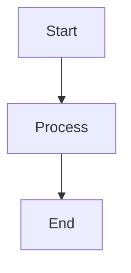

# Haprial Blog Theme

> **[中文文档](README_CN.md)** | English

> ⚠️ **Note:** This project was entirely created through **vibe coding** — a process of building by intuition, feel, and iterative experimentation rather than formal specifications. The code may not follow conventional patterns, but it works and feels right.
>
> If you use this project for your blog, I'd love to hear about it! Please let me know by opening an issue or starring the repo. Your feedback helps improve the project. ⭐

A minimal, zero-dependency static blog theme with Material Design 3 aesthetics. Built for performance and pixel-perfect reproduction.

### Desktop Preview


### Mobile Preview


---

**Welcome to star ⭐ and fork 🍴!**

> 📖 **Documentation**
> - [Comments System (Worker)](worker/README.md) - Backend for comments
> - [Admin Dashboard](admin/) - Manage your blog

## ✨ Features

- ⚡ **Zero Dependencies** - Pure Node.js build system
- 🎨 **Material Design 3** - Light and dark mode with MD3 color system
- 📱 **Fully Responsive** - Works on all devices
- 🔍 **SEO Optimized** - Meta tags, OG, JSON-LD, sitemap, RSS
- 🚀 **Static HTML** - No JavaScript required for content
- 📝 **Markdown Content** - Front matter support
- 🏷️ **Tags & Categories** - Organize your content
- 🔗 **Friend Links** - Showcase other blogs
- 🔎 **Full-text Search** - Client-side search
- 📖 **Table of Contents** - Auto-generated TOC
- 🎭 **Smooth Animations** - CSS and JS animations
- 💬 **Comments System** - Optional Cloudflare Worker backend
- 🌙 **Dark Mode** - Automatic and manual toggle
- 📊 **Mermaid Diagrams** - Built-in support

## 🚀 Quick Start

### 1. Clone the Repository

```bash
git clone https://github.com/Moriefy/blog-theme-haprial.git
cd blog-theme-haprial
```

### 2. Configure Your Blog

Edit `site.config.json`:

```json
{
  "title": "Your Blog Title",
  "tagline": "Your blog tagline",
  "description": "A brief description of your blog.",
  "url": "https://your-domain.com",
  "author": "Your Name",
  "bio": ["Your bio paragraph 1", "Your bio paragraph 2"],
  "skills": ["Skill 1", "Skill 2", "Skill 3"],
  "links": [
    { "name": "GitHub", "url": "https://github.com/yourusername" },
    { "name": "Twitter", "url": "https://twitter.com/yourusername" }
  ],
  "categories": [
    { "name": "Technology", "slug": "tech", "desc": "Tech posts", "color": "#3e505b" }
  ],
  "comments": {
    "enabled": false,
    "provider": "custom",
    "api": ""
  },
  "friends": []
}
```

### 3. Write Your First Post

Create a file in `content/blog/`:

```markdown
---
title: "My First Post"
date: "January 1, 2024"
dateISO: "2024-01-01"
readingTime: "5 min"
tags: ["Hello", "World"]
category: "tech"
excerpt: "This is my first post."
---

## Hello World

Your content here...
```

### 4. Build and Preview

```bash
# Build
node build.js

# Preview
cd dist && npx serve
```

### 5. Deploy

#### Vercel (Recommended)

1. Push to GitHub
2. Import in [Vercel](https://vercel.com)
3. Framework: **Other**
4. Build Command: `node build.js`
5. Output Directory: `dist`

#### Other Platforms

The build output in `dist/` is a standard static site. Deploy to any static hosting:

- Netlify
- GitHub Pages
- Cloudflare Pages
- AWS S3
- Any web server

## 📁 Project Structure

```
blog-theme-haprial/
├── content/
│   └── blog/           # Blog posts (Markdown files)
├── lib/
│   └── markdown.js     # Markdown parser
├── theme/
│   ├── styles.css      # Main stylesheet
│   ├── app.js          # Main JavaScript
│   ├── article.js      # Article page logic
│   ├── comments.css    # Comments styles
│   ├── comments.js     # Comments frontend
│   ├── core.js         # Core utilities
│   ├── events.js       # Event handlers
│   ├── lightbox.js     # Image lightbox
│   ├── mermaid.js      # Mermaid diagrams
│   ├── pages.js        # Page routing
│   ├── routing.js      # URL routing
│   ├── toc.js          # Table of contents
│   └── twikoo-custom.css
├── static/
│   ├── avatar.png      # Your avatar
│   ├── favicon.svg     # Favicon
│   └── images/         # Static images
├── src/
│   └── 404.html        # 404 page
├── worker/             # Cloudflare Worker (optional)
│   ├── index.js        # Worker code
│   ├── schema.sql      # Database schema
│   └── wrangler.toml   # Worker config
├── site.config.json    # Site configuration
├── build.js            # Build script
├── vercel.json         # Vercel config
└── package.json
```

## ⚙️ Configuration

### site.config.json

| Field | Type | Description |
|-------|------|-------------|
| `title` | string | Blog title |
| `tagline` | string | Blog tagline |
| `description` | string | Blog description (for SEO) |
| `url` | string | Blog URL |
| `author` | string | Author name |
| `bio` | string[] | Author bio paragraphs |
| `skills` | string[] | Author skills |
| `links` | object[] | Social links |
| `categories` | object[] | Blog categories |
| `comments` | object | Comments configuration |
| `friends` | object[] | Friend links |

### Categories

```json
{
  "name": "Technology",
  "slug": "tech",
  "desc": "Posts about technology",
  "color": "#3e505b"
}
```

### Comments System

The theme supports a comments system powered by Cloudflare Workers:

1. Deploy the worker in `worker/` to Cloudflare
2. Set the `comments.api` in `site.config.json`
3. Set `comments.enabled` to `true`

See [worker/README.md](worker/README.md) for details.

## 🎨 Customization

### Colors

Edit `theme/styles.css` to customize colors:

```css
:root {
  --primary: #6750a4;
  --on-primary: #ffffff;
  --primary-container: #eaddff;
  /* ... more MD3 colors */
}
```

### Fonts

Edit the font imports in `build.js`:

```javascript
const FONTS = 'https://fonts.googleapis.com/css2?family=Your+Font:wght@300;400;600&display=swap';
```

### Layout

The theme uses a responsive grid layout. Customize in `theme/styles.css`:

```css
.container {
  max-width: 1200px;
  margin: 0 auto;
  padding: 0 24px;
}
```

## 📝 Writing Posts

### Front Matter

| Field | Required | Description |
|-------|----------|-------------|
| `title` | Yes | Post title |
| `date` | Yes | Display date |
| `dateISO` | Yes | ISO date (YYYY-MM-DD) |
| `readingTime` | Yes | Estimated reading time |
| `tags` | Yes | Array of tags |
| `category` | Yes | Category slug |
| `excerpt` | Yes | Short description |

### Markdown Features

- Headers (H1-H6)
- Bold, italic, strikethrough
- Links and images
- Code blocks with syntax highlighting
- Blockquotes
- Lists (ordered and unordered)
- Tables
- Mermaid diagrams
- Math equations (via KaTeX)

### Example Post

```markdown
---
title: "Getting Started with Markdown"
date: "January 15, 2024"
dateISO: "2024-01-15"
readingTime: "5 min"
tags: ["Markdown", "Tutorial"]
category: "tech"
excerpt: "Learn how to write posts in Markdown."
---

## Introduction

Markdown is a lightweight markup language...

### Code Blocks

```javascript
function hello() {
  console.log('Hello, World!');
}
```

### Mermaid Diagrams



### Tables

| Feature | Status |
|---------|--------|
| Markdown | ✅ |
| Mermaid | ✅ |
| KaTeX | ✅ |
```

## 🔧 Development

### Local Development

```bash
# Install dependencies (none required!)
# Build and watch for changes
node build.js

# Preview
cd dist && npx serve
```

### Adding Features

The build system is modular:

- `lib/markdown.js` - Markdown parser
- `build.js` - Build orchestrator
- `theme/` - Frontend assets

## 📄 License

MIT License - feel free to use for personal or commercial projects.

## 🙏 Credits

Built with ❤️ by [Moriefy](https://github.com/Moriefy)

## 🤝 Contributing

Contributions are welcome! Please feel free to submit a Pull Request.

1. Fork the repository
2. Create your feature branch (`git checkout -b feature/amazing-feature`)
3. Commit your changes (`git commit -m 'Add some amazing feature'`)
4. Push to the branch (`git push origin feature/amazing-feature`)
5. Open a Pull Request

## 📧 Support

If you have any questions or need help, please open an issue on GitHub.
