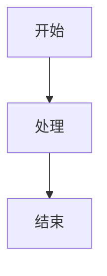

# Haprial 博客主题

> 中文文档 | **[English](README.md)**

> ⚠️ **说明：** 本项目完全通过 **Vibe Coding**（氛围编程）创建——这是一种依靠直觉、感觉和反复试验来构建的过程，而非遵循正式的规范。代码可能不符合传统模式，但它能工作，而且感觉对了。
>
> 如果你采用本项目作为你的博客，我很想听听你的使用体验！请通过 Issue 告诉我，或者给项目一个 Star。你的反馈有助于项目的改进。⭐

一个极简、零依赖的静态博客主题，采用 Material Design 3 设计语言。专注于性能和像素级还原。

### 桌面端预览


### 移动端预览


---

**欢迎 Star ⭐ 和 Fork 🍴！**

> 📖 **文档**
> - [评论系统 (Worker)](worker/README_CN.md) - 评论后端
> - [管理后台](admin/) - 管理你的博客

---

## ✨ 特性

### 🎨 Material Design 3

采用 Google 的 Material Design 3 设计系统。支持亮色和暗色模式，自动检测系统偏好。

### ⚡ 零依赖

纯 Node.js 构建系统。无需 npm install。只需 `node build.js` 即可完成。

### 📱 响应式设计

完美适配所有设备——手机、平板和电脑。

### 🔍 SEO 优化

- 带 Open Graph 的 Meta 标签
- JSON-LD 结构化数据
- 自动生成 sitemap.xml
- 自动生成 RSS 订阅源
- robots.txt

### 📖 自动生成目录

在 Markdown 中使用 `[TOC]` 即可自动生成目录。支持嵌套标题（H2、H3）。

### 📝 Markdown 功能

完整的 Markdown 支持，包括：

- **文本格式** - 粗体、斜体、删除线
- **代码块** - 带语法高亮
- **表格** - 标准 Markdown 表格
- **引用块** - 支持嵌套引用
- **列表** - 有序和无序
- **链接** - 内部和外部链接
- **图片** - 带懒加载
- **脚注** - `[^1]` 语法，自动编号
- **任务列表** - `- [ ]` 和 `- [x]` 语法

### 📊 Mermaid 图表

内置 Mermaid 图表支持：

- 流程图
- 时序图
- 饼图
- 更多...

### 💬 评论系统

基于 Cloudflare Workers 的可选评论系统：

- 评论增删改查
- 点赞系统
- 管理后台
- 频率限制
- 邮件通知（通过 Resend）

### 🎭 流畅动画

CSS 和 JavaScript 动画，打造精致的用户体验：

- 页面过渡
- 卡片动画
- 滚动效果
- 图片灯箱

### 🌙 暗色模式

基于系统偏好的自动暗色模式，支持手动切换。

### 🔎 全文搜索

客户端全文搜索，即时返回结果。

### 📡 RSS 订阅

自动生成 RSS 订阅源。

---

## 🚀 快速开始

### 1. 克隆仓库

```bash
git clone https://github.com/Moriefy/blog-theme-haprial.git
cd blog-theme-haprial
```

### 2. 配置博客

编辑 `site.config.json`：

```json
{
  "title": "你的博客标题",
  "tagline": "你的博客标语",
  "description": "博客的简短描述。",
  "url": "https://你的域名.com",
  "author": "你的名字",
  "bio": ["你的简介第一段", "你的简介第二段"],
  "skills": ["技能1", "技能2", "技能3"],
  "links": [
    { "name": "GitHub", "url": "https://github.com/你的用户名" },
    { "name": "Twitter", "url": "https://twitter.com/你的用户名" }
  ],
  "categories": [
    { "name": "技术", "slug": "tech", "desc": "技术相关文章", "color": "#3e505b" }
  ],
  "comments": {
    "enabled": false,
    "provider": "custom",
    "api": ""
  },
  "friends": []
}
```

### 3. 添加头像

将 `static/avatar.png` 替换为你自己的头像图片。

### 4. 撰写第一篇文章

在 `content/blog/` 目录下创建 `.md` 文件：

```markdown
---
title: "文章标题"
date: "2024年1月1日"
dateISO: "2024-01-01"
readingTime: "5 分钟"
tags: ["标签1", "标签2"]
category: "tech"
excerpt: "文章摘要。"
---

[TOC]

## 简介

正文内容...

## 代码示例

```javascript
function hello() {
  console.log('你好，世界！');
}
```

## Mermaid 图表



## 脚注

这是一个带有脚注的句子[^1]。

[^1]: 这是脚注内容。
```

### 5. 构建和部署

```bash
# 构建
node build.js

# 本地预览
cd dist && npx serve
```

### 6. 部署到 Vercel

1. 推送到 GitHub
2. 在 [Vercel](https://vercel.com) 导入
3. 框架：**Other**
4. 构建命令：`node build.js`
5. 输出目录：`dist`

---

## 📁 项目结构

```
blog-theme-haprial/
├── content/
│   └── blog/           # 博客文章（Markdown 文件）
├── lib/
│   └── markdown.js     # Markdown 解析器
├── theme/
│   ├── styles.css      # 主样式表
│   ├── app.js          # 主 JavaScript
│   ├── article.js      # 文章页面逻辑
│   ├── comments.css    # 评论样式
│   ├── comments.js     # 评论前端
│   ├── core.js         # 核心工具
│   ├── events.js       # 事件处理
│   ├── lightbox.js     # 图片灯箱
│   ├── mermaid.js      # Mermaid 图表
│   ├── pages.js        # 页面路由
│   ├── routing.js      # URL 路由
│   ├── toc.js          # 目录
│   └── twikoo-custom.css
├── static/
│   ├── avatar.png      # 你的头像
│   ├── favicon.svg     # 网站图标
│   └── images/         # 静态图片
├── src/
│   └── 404.html        # 404 页面
├── worker/             # Cloudflare Worker（可选）
│   ├── index.js        # Worker 代码
│   ├── schema.sql      # 数据库结构
│   └── wrangler.toml   # Worker 配置
├── site.config.json    # 站点配置
├── build.js            # 构建脚本
├── vercel.json         # Vercel 配置
└── package.json
```

---

## ⚙️ 配置说明

### site.config.json

| 字段 | 类型 | 说明 |
|------|------|------|
| `title` | string | 博客标题 |
| `tagline` | string | 博客标语 |
| `description` | string | 博客描述（用于 SEO） |
| `url` | string | 博客 URL |
| `author` | string | 作者名字 |
| `bio` | string[] | 作者简介段落 |
| `skills` | string[] | 作者技能 |
| `links` | object[] | 社交链接 |
| `categories` | object[] | 博客分类 |
| `comments` | object | 评论配置 |
| `friends` | object[] | 友链 |

### 分类配置

```json
{
  "name": "技术",
  "slug": "tech",
  "desc": "技术相关文章",
  "color": "#3e505b"
}
```

### 评论系统

主题支持基于 Cloudflare Workers 的评论系统：

1. 将 `worker/` 目录部署到 Cloudflare
2. 在 `site.config.json` 中设置 `comments.api`
3. 将 `comments.enabled` 设置为 `true`

详见 [worker/README_CN.md](worker/README_CN.md)。

---

## 🎨 自定义

### 颜色

编辑 `theme/styles.css` 自定义颜色：

```css
:root {
  --primary: #6750a4;
  --on-primary: #ffffff;
  --primary-container: #eaddff;
  /* ... 更多 MD3 颜色 */
}
```

### 字体

编辑 `build.js` 中的字体导入：

```javascript
const FONTS = 'https://fonts.googleapis.com/css2?family=Your+Font:wght@300;400;600&display=swap';
```

### 布局

主题使用响应式网格布局，在 `theme/styles.css` 中自定义：

```css
.container {
  max-width: 1200px;
  margin: 0 auto;
  padding: 0 24px;
}
```

---

## 📝 撰写文章

### Front Matter

| 字段 | 必填 | 说明 |
|------|------|------|
| `title` | 是 | 文章标题 |
| `date` | 是 | 显示日期 |
| `dateISO` | 是 | ISO 日期（YYYY-MM-DD） |
| `readingTime` | 是 | 预计阅读时间 |
| `tags` | 是 | 标签数组 |
| `category` | 是 | 分类 slug |
| `excerpt` | 是 | 简短描述 |

### 特殊功能

#### 目录

在文章中任意位置添加 `[TOC]` 即可生成目录：

```markdown
[TOC]

## 第一节

正文内容...

### 子章节 1.1

正文内容...
```

#### 脚注

使用 `[^name]` 作为脚注引用，`[^name]: text` 作为定义：

```markdown
这是一个带有脚注的句子[^1]。

[^1]: 这是脚注内容。
```

#### Mermaid 图表

使用 `mermaid` 语言的代码块：

````markdown

````

---

## 🔧 开发

### 本地开发

```bash
# 构建并监听变化
node build.js

# 预览
cd dist && npx serve
```

### 添加功能

构建系统是模块化的：

- `lib/markdown.js` - Markdown 解析器
- `build.js` - 构建编排器
- `theme/` - 前端资源

---

## 📄 许可证

MIT 许可证 - 可自由用于个人或商业项目。

---

## 🙏 致谢

由 [Moriefy](https://github.com/Moriefy) 用 ❤️ 构建

---

## 🤝 贡献

欢迎贡献！请随时提交 Pull Request。

1. Fork 仓库
2. 创建功能分支 (`git checkout -b feature/amazing-feature`)
3. 提交更改 (`git commit -m '添加一些惊人的功能'`)
4. 推送到分支 (`git push origin feature/amazing-feature`)
5. 打开 Pull Request

---

## 📧 支持

如有任何问题或需要帮助，请在 GitHub 上提交 Issue。
