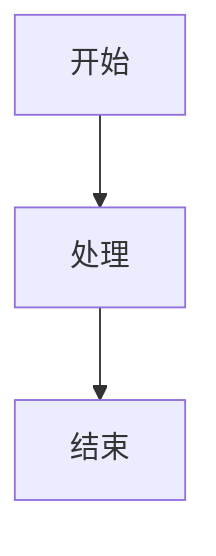

# Haprial 博客主题

一个极简、零依赖的静态博客主题，采用 Material Design 3 设计语言。专注于性能和像素级还原。


## ✨ 特性

- ⚡ **零依赖** - 纯 Node.js 构建系统
- 🎨 **Material Design 3** - 支持亮色/暗色模式，采用 MD3 色彩系统
- 📱 **完全响应式** - 适配所有设备
- 🔍 **SEO 优化** - Meta 标签、Open Graph、JSON-LD、站点地图、RSS
- 🚀 **静态 HTML** - 内容无需 JavaScript
- 📝 **Markdown 内容** - 支持 Front Matter
- 🏷️ **标签和分类** - 内容组织
- 🔗 **友链页面** - 展示其他博客
- 🔎 **全文搜索** - 客户端搜索
- 📖 **目录** - 自动生成目录
- 🎭 **流畅动画** - CSS 和 JS 动画
- 💬 **评论系统** - 可选的 Cloudflare Worker 后端
- 🌙 **暗色模式** - 自动和手动切换
- 📊 **Mermaid 图表** - 内置支持

## 🚀 快速开始

### 1. 克隆仓库

```bash
git clone https://github.com/Moriefy/blog-theme-haprial.git
cd blog-theme-haprial
```

### 2. 配置博客

编辑 `site.config.json`：

```json
{
  "title": "你的博客标题",
  "tagline": "你的博客标语",
  "description": "博客的简短描述。",
  "url": "https://your-domain.com",
  "author": "你的名字",
  "bio": ["你的简介第一段", "你的简介第二段"],
  "skills": ["技能1", "技能2", "技能3"],
  "links": [
    { "name": "GitHub", "url": "https://github.com/yourusername" },
    { "name": "Twitter", "url": "https://twitter.com/yourusername" }
  ],
  "categories": [
    { "name": "技术", "slug": "tech", "desc": "技术相关文章", "color": "#3e505b" }
  ],
  "comments": {
    "enabled": false,
    "provider": "custom",
    "api": ""
  },
  "friends": []
}
```

### 3. 撰写第一篇文章

在 `content/blog/` 目录下创建文件：

```markdown
---
title: "我的第一篇文章"
date: "2024年1月1日"
dateISO: "2024-01-01"
readingTime: "5 分钟"
tags: ["你好", "世界"]
category: "tech"
excerpt: "这是我的第一篇文章。"
---

## 你好世界

欢迎来到你的新博客！这是你的第一篇文章。你可以编辑或删除它，然后开始写作。
```

### 4. 构建和预览

```bash
# 构建
node build.js

# 预览
cd dist && npx serve
```

### 5. 部署

#### Vercel（推荐）

1. 推送到 GitHub
2. 在 [Vercel](https://vercel.com) 导入
3. 框架：**Other**
4. 构建命令：`node build.js`
5. 输出目录：`dist`

#### 其他平台

`dist/` 目录下的构建输出是标准静态站点，可以部署到任何静态托管服务：

- Netlify
- GitHub Pages
- Cloudflare Pages
- AWS S3
- 任何 Web 服务器

## 📁 项目结构

```
blog-theme-haprial/
├── content/
│   └── blog/           # 博客文章（Markdown 文件）
├── lib/
│   └── markdown.js     # Markdown 解析器
├── theme/
│   ├── styles.css      # 主样式表
│   ├── app.js          # 主 JavaScript
│   ├── article.js      # 文章页面逻辑
│   ├── comments.css    # 评论样式
│   ├── comments.js     # 评论前端
│   ├── core.js         # 核心工具
│   ├── events.js       # 事件处理
│   ├── lightbox.js     # 图片灯箱
│   ├── mermaid.js      # Mermaid 图表
│   ├── pages.js        # 页面路由
│   ├── routing.js      # URL 路由
│   ├── toc.js          # 目录
│   └── twikoo-custom.css
├── static/
│   ├── avatar.png      # 你的头像
│   ├── favicon.svg     # 网站图标
│   └── images/         # 静态图片
├── src/
│   └── 404.html        # 404 页面
├── worker/             # Cloudflare Worker（可选）
│   ├── index.js        # Worker 代码
│   ├── schema.sql      # 数据库结构
│   └── wrangler.toml   # Worker 配置
├── site.config.json    # 站点配置
├── build.js            # 构建脚本
├── vercel.json         # Vercel 配置
└── package.json
```

## ⚙️ 配置说明

### site.config.json

| 字段 | 类型 | 说明 |
|------|------|------|
| `title` | string | 博客标题 |
| `tagline` | string | 博客标语 |
| `description` | string | 博客描述（用于 SEO） |
| `url` | string | 博客 URL |
| `author` | string | 作者名字 |
| `bio` | string[] | 作者简介段落 |
| `skills` | string[] | 作者技能 |
| `links` | object[] | 社交链接 |
| `categories` | object[] | 博客分类 |
| `comments` | object | 评论配置 |
| `friends` | object[] | 友链 |

### 分类配置

```json
{
  "name": "技术",
  "slug": "tech",
  "desc": "技术相关文章",
  "color": "#3e505b"
}
```

### 评论系统

主题支持基于 Cloudflare Workers 的评论系统：

1. 将 `worker/` 目录部署到 Cloudflare
2. 在 `site.config.json` 中设置 `comments.api`
3. 将 `comments.enabled` 设置为 `true`

详见 [worker/README.md](worker/README.md)。

## 🎨 自定义

### 颜色

编辑 `theme/styles.css` 自定义颜色：

```css
:root {
  --primary: #6750a4;
  --on-primary: #ffffff;
  --primary-container: #eaddff;
  /* ... 更多 MD3 颜色 */
}
```

### 字体

编辑 `build.js` 中的字体导入：

```javascript
const FONTS = 'https://fonts.googleapis.com/css2?family=Your+Font:wght@300;400;600&display=swap';
```

### 布局

主题使用响应式网格布局，在 `theme/styles.css` 中自定义：

```css
.container {
  max-width: 1200px;
  margin: 0 auto;
  padding: 0 24px;
}
```

## 📝 撰写文章

### Front Matter

| 字段 | 必填 | 说明 |
|------|------|------|
| `title` | 是 | 文章标题 |
| `date` | 是 | 显示日期 |
| `dateISO` | 是 | ISO 日期（YYYY-MM-DD） |
| `readingTime` | 是 | 预计阅读时间 |
| `tags` | 是 | 标签数组 |
| `category` | 是 | 分类 slug |
| `excerpt` | 是 | 简短描述 |

### Markdown 特性

- 标题（H1-H6）
- 粗体、斜体、删除线
- 链接和图片
- 代码块（带语法高亮）
- 引用块
- 有序和无序列表
- 表格
- Mermaid 图表
- 数学公式（通过 KaTeX）

### 示例文章

```markdown
---
title: "Markdown 入门指南"
date: "2024年1月15日"
dateISO: "2024-01-15"
readingTime: "5 分钟"
tags: ["Markdown", "教程"]
category: "tech"
excerpt: "学习如何使用 Markdown 撰写文章。"
---

## 简介

Markdown 是一种轻量级标记语言...

### 代码块

```javascript
function hello() {
  console.log('你好，世界！');
}
```

### Mermaid 图表



### 表格

| 特性 | 状态 |
|------|------|
| Markdown | ✅ |
| Mermaid | ✅ |
| KaTeX | ✅ |
```

## 🔧 开发

### 本地开发

```bash
# 安装依赖（无需安装！）
# 构建并监听变化
node build.js

# 预览
cd dist && npx serve
```

### 添加功能

构建系统是模块化的：

- `lib/markdown.js` - Markdown 解析器
- `build.js` - 构建编排器
- `theme/` - 前端资源

## 📄 许可证

MIT 许可证 - 可自由用于个人或商业项目。

## 🙏 致谢

由 [Moriefy](https://github.com/Moriefy) 用 ❤️ 构建

## 🤝 贡献

欢迎贡献！请随时提交 Pull Request。

1. Fork 仓库
2. 创建功能分支 (`git checkout -b feature/amazing-feature`)
3. 提交更改 (`git commit -m '添加一些惊人的功能'`)
4. 推送到分支 (`git push origin feature/amazing-feature`)
5. 打开 Pull Request

## 📧 支持

如有任何问题或需要帮助，请在 GitHub 上提交 Issue。
