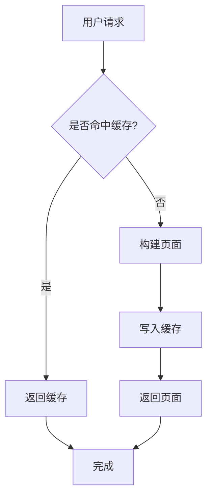
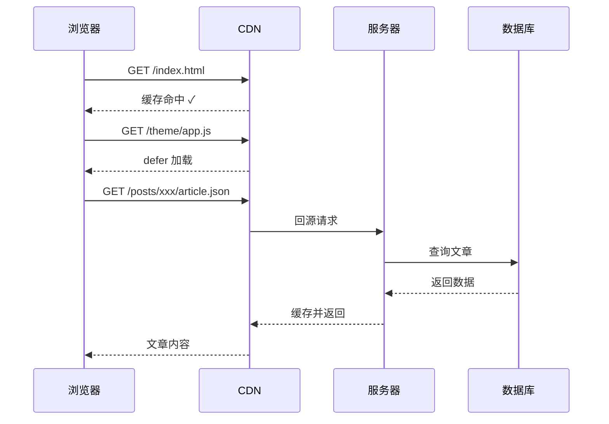
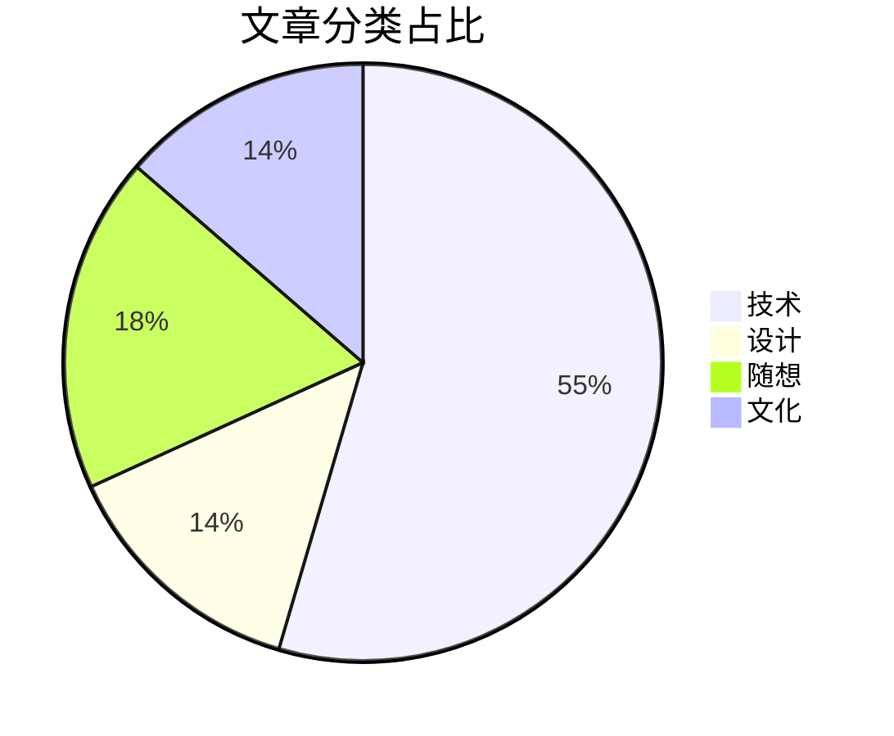

## 流程图 {#flowchart}


```mermaid
graph TD
    A[用户请求] --> B{是否命中缓存?}
    B -->|是| C[返回缓存]
    B -->|否| D[构建页面]
    D --> E[写入缓存]
    E --> F[返回页面]
    C --> G[完成]
    F --> G
```

## 时序图 {#sequence}


```mermaid
sequenceDiagram
    participant 浏览器
    participant CDN
    participant 服务器
    participant 数据库

    浏览器->>CDN: GET /index.html
    CDN-->>浏览器: 缓存命中 ✓
    浏览器->>CDN: GET /theme/app.js
    CDN-->>浏览器: defer 加载
    浏览器->>CDN: GET /posts/xxx/article.json
    CDN->>服务器: 回源请求
    服务器->>数据库: 查询文章
    数据库-->>服务器: 返回数据
    服务器-->>CDN: 缓存并返回
    CDN-->>浏览器: 文章内容
```

## 使用方式 {#usage}

在 Markdown 中用 ` ```mermaid ` 代码块即可：


```mermaid
pie title 文章分类占比
    "技术" : 12
    "设计" : 3
    "随想" : 4
    "文化" : 3
```

博客引擎会自动将 Mermaid 代码块渲染为 SVG 图表，支持深色模式。点击饼状图的扇区可查看名称标注（扇区会略微放大），再次点击取消。
