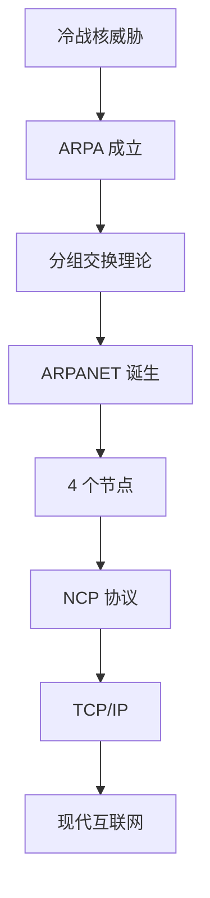
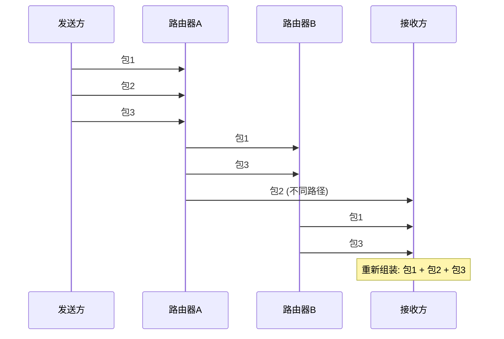
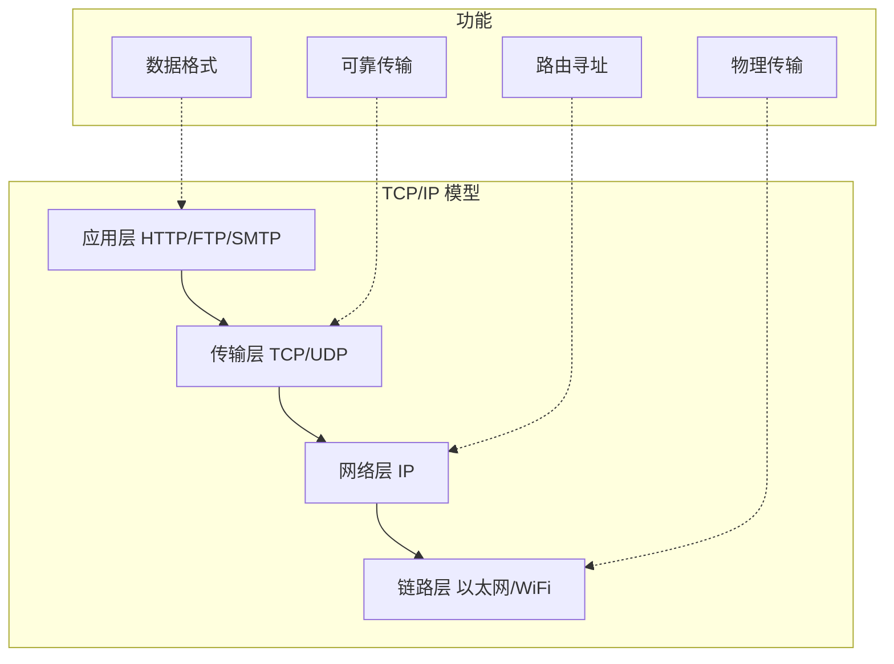
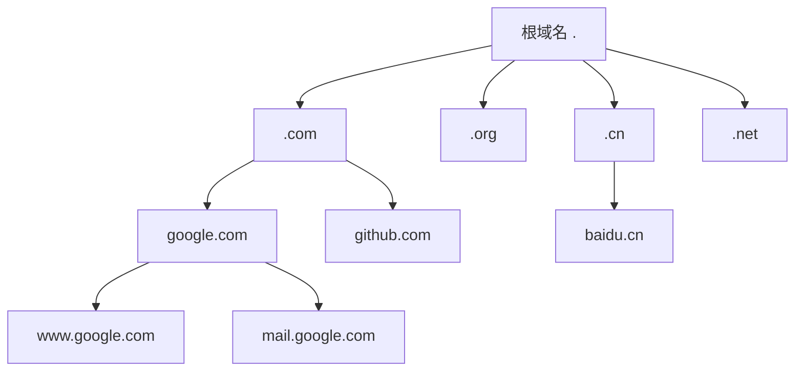
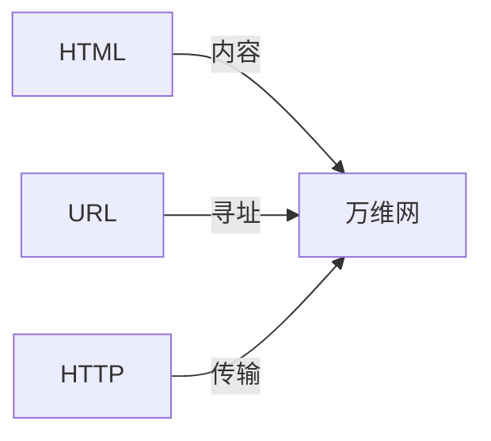
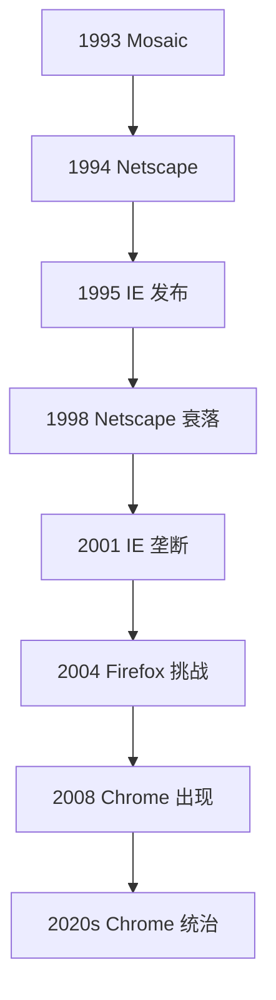
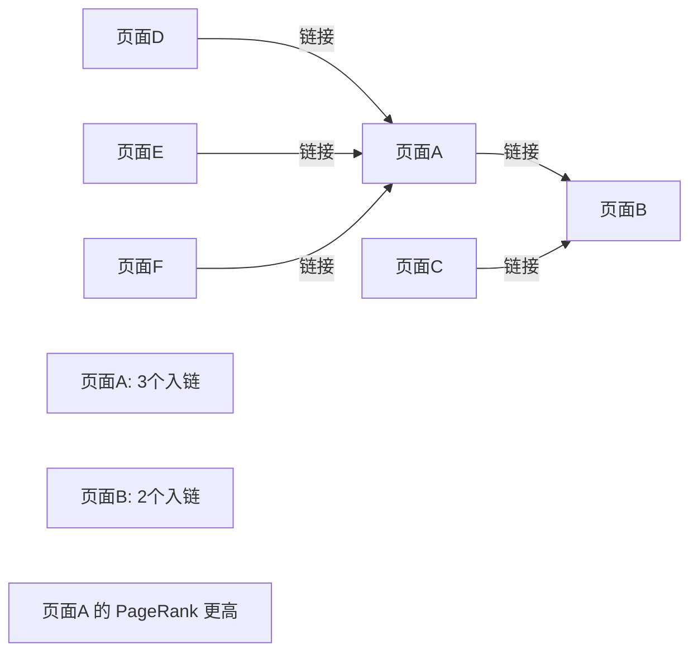
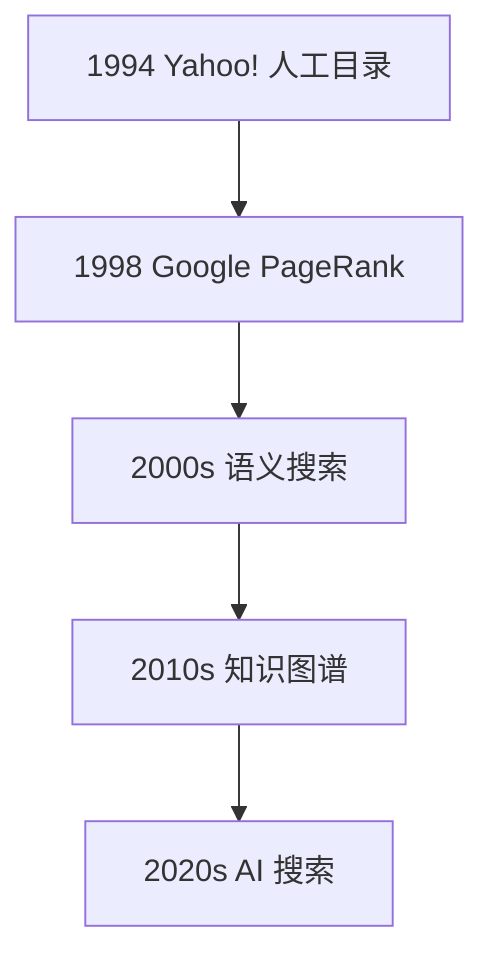
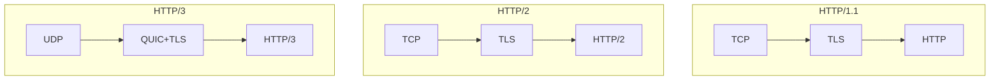
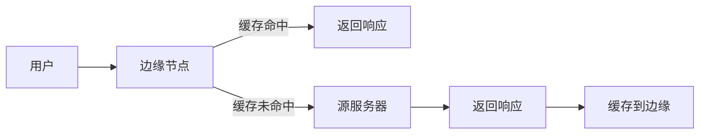

## 冷战的遗产：ARPANET 的诞生 {#arpanet}

1957 年 10 月 4 日，苏联发射了人造卫星 Sputnik。这个直径 58 厘米的金属球改变了世界格局，也催生了互联网。

美国国防部成立了 ARPA（高级研究计划局），其中一个核心目标是：**建立一个即使部分节点被核弹摧毁也能继续工作的通信网络**。



### 分组交换：互联网的理论基础 {#packet-switching}

传统的电话网络使用**电路交换**——通话双方之间建立一条专用线路，通话期间这条线路被独占。这很浪费——通话中的沉默也占用带宽。

1961 年，Paul Baran 和 Donald Davies 独立提出了**分组交换**的思想：把数据切成小块（包），每个包独立路由，到达目的地后重新组装。



分组交换的革命性在于：
- **不需要专用线路**：多个通信共享同一条链路
- **自动绕过故障**：如果某条路径断了，包可以走其他路径
- **高效利用带宽**：沉默期间不占用资源

### 第一条消息：LO {#first-message}

1969 年 10 月 29 日，UCLA 的学生 Charley Kline 试图登录斯坦福研究所的计算机。他输入 `LOGIN`，但系统在传完 `LO` 后崩溃了。

互联网的第一条消息是 `LO`——不是 Hello，而是崩溃后的残余。这个不完美的开始，预示了互联网发展中的许多故事：**伟大的事物往往从混乱中诞生**。

到 1969 年底，ARPANET 有 4 个节点：
1. UCLA — 网络测量中心
2. 斯坦福研究所 — 网络信息中心
3. UC 圣巴巴拉分校 — Culler-Fried 交互式数学
4. 犹他大学 — Evans Hall

## 协议的演化：从 NCP 到 TCP/IP {#protocols}

### NCP：第一个网络协议 {#ncp}

ARPANET 最初使用 NCP（Network Control Protocol）。NCP 假设网络是可靠的——所有包都会到达，不会丢失，不会乱序。

这个假设在小规模网络中成立，但当网络扩大后，问题暴露了。

### TCP/IP 的诞生 {#tcpip}

1974 年，Vint Cerf 和 Bob Kahn 发表了论文《A Protocol for Packet Network Intercommunication》，提出了 TCP/IP 协议。

TCP/IP 的设计哲学与 NCP 截然不同：**假设网络不可靠，在端到端实现可靠性**。



1983 年 1 月 1 日，ARPANET 正式从 NCP 切换到 TCP/IP。这个日子被称为 **Flag Day**。

### DNS：人脑不擅长记数字 {#dns}

1983 年之前，网络上的计算机通过 hosts.txt 文件互相查找。每台计算机都需要下载这个文件，随着网络扩大，这变得不可持续。

1983 年，Paul Mockapetris 设计了 DNS（Domain Name System）——一个分布式的、层次化的命名系统。



DNS 的设计是互联网最优雅的系统之一：
- **分布式**：没有单点故障
- **层次化**：从根到叶子逐级查询
- **缓存友好**：每一层都可以缓存结果
- **可扩展**：新的顶级域名可以随时添加

## 万维网：互联网的杀手应用 {#www}

### Tim Berners-Lee 的三个发明 {#tbl}

1989 年，在欧洲核子研究中心（CERN），Tim Berners-Lee 提出了一个信息系统方案。他发明了三个东西：

1. **HTML**（HyperText Markup Language）：超文本标记语言
2. **URL**（Uniform Resource Locator）：统一资源定位符
3. **HTTP**（HyperText Transfer Protocol）：超文本传输协议



这三个发明看似简单，却解决了信息系统的三个根本问题：
- 如何表示信息？→ HTML
- 如何定位信息？→ URL
- 如何传输信息？→ HTTP

### 浏览器之战 {#browser-wars}

1993 年，NCSA 发布了 Mosaic——第一个支持图片显示的浏览器。互联网从此不再是纯文本的世界。

1994 年，Mosaic 的核心开发者 Marc Andreessen 离开 NCSA，创建了 Netscape。Netscape Navigator 迅速占领了市场。

1995 年，微软发布了 Internet Explorer，捆绑在 Windows 中。**浏览器之战**正式爆发。



浏览器之战的教训：
- **平台优势巨大**：Windows 捆绑 IE 直接消灭了 Netscape
- **标准很重要**：没有标准，就会被垄断者控制
- **创新需要竞争**：Chrome 的出现让浏览器技术飞速发展

### Web 标准的诞生 {#standards}

浏览器的不兼容导致了 Web 开发的噩梦。同一段代码在 IE 和 Netscape 中的表现完全不同。

1994 年，W3C（万维网联盟）成立，致力于制定统一的 Web 标准。

W3C 的标准制定过程：
1. **工作草案**（Working Draft）：初步提案
2. **候选推荐**（Candidate Recommendation）：基本成型
3. **提案推荐**（Proposed Recommendation）：准备采纳
4. **W3C 推荐**（W3C Recommendation）：正式标准

## 搜索引擎：信息的入口 {#search}

### 早期搜索引擎 {#early-search}

互联网上的信息爆炸式增长，找到需要的信息变得越来越难。

1994 年，Jerry Yang 和 David Filo 创建了 Yahoo!——一个**人工分类**的网站目录。

1998 年，Larry Page 和 Sergey Brin 创建了 Google。Google 的革命性创新是 **PageRank 算法**——不是看关键词匹配，而是看**谁链接到了这个页面**。



PageRank 的核心思想：**一个页面被越多高质量页面链接，它自身就越重要**。这就像学术论文的引用——被引用越多的论文，通常越有价值。

### 搜索引擎的演化 {#search-evo}



## 移动互联网：口袋里的世界 {#mobile}

### iPhone 的冲击 {#iphone}

2007 年 1 月 9 日，Steve Jobs 发布了 iPhone。这不仅是一部手机，更是一台**口袋里的电脑**。

iPhone 对互联网的影响：
- **触摸屏成为标准**：所有交互都基于手指
- **App Store 生态**：原生应用 vs Web 应用的争论
- **移动优先设计**：响应式设计成为必须

### 响应式设计 {#responsive}

2010 年，Ethan Marcotte 提出了**响应式 Web 设计**（Responsive Web Design）：

```css
/* 媒体查询：根据屏幕大小调整布局 */
@media (max-width: 768px) {
  .sidebar { display: none; }
  .content { width: 100%; }
}
```

响应式设计的三大技术：
1. **流式布局**：使用百分比而非固定像素
2. **弹性图片**：`max-width: 100%`
3. **媒体查询**：`@media`

## 现代互联网：2020s {#modern}

### HTTP/3 和 QUIC {#http3}

HTTP/3 使用 QUIC 协议替代了 TCP。QUIC 基于 UDP，但实现了 TCP 的可靠性保证。



QUIC 的优势：
- **0-RTT 连接建立**：首次 1-RTT，后续 0-RTT
- **多路复用无队头阻塞**：单个流的阻塞不影响其他流
- **连接迁移**：WiFi 切换到 4G 不断连

### 边缘计算 {#edge}

传统架构中，用户请求需要到达源服务器。边缘计算将计算推到离用户更近的地方：



CDN、边缘函数（Cloudflare Workers、Vercel Edge Functions）都是边缘计算的体现。我们的博客部署在 Vercel 上，静态资源通过全球 CDN 分发。

## 互联网的未来 {#future}

### WebAssembly {#wasm}

WebAssembly（Wasm）让浏览器运行接近原生速度的代码。它可以编译 C/C++/Rust，让浏览器成为通用计算平台。

### 去中心化 {#decentralized}

区块链和去中心化协议试图打破大公司对互联网的垄断。IPFS 提供去中心化存储，ENS 提供去中心化域名。

### AI 与互联网 {#ai}

大语言模型正在改变人们获取信息的方式。搜索引擎从"给你链接"变成"给你答案"。

## 结语 {#conclusion}

从 1969 年的 `LO` 到 2026 年的 AI 搜索，互联网经历了 57 年的演化。每一个阶段都有它的英雄和故事，每一个技术决策都有它的背景和取舍。

理解历史，是为了更好地理解现在，也为了更好地预见未来。


互联网的故事远未结束。下一个五十年，又会有怎样的变革？
