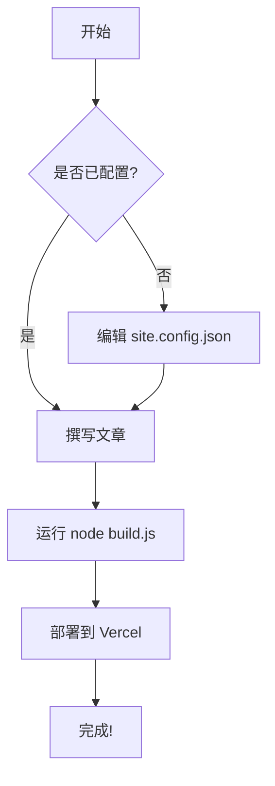
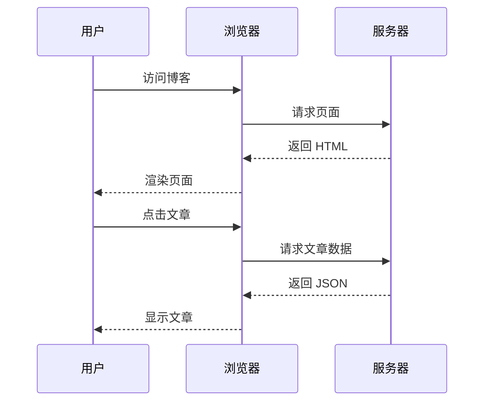
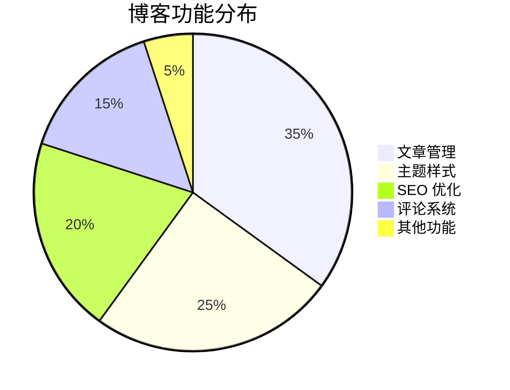

## 你好，世界 👋

欢迎来到你的新博客！这是自动生成的第一篇文章。本文将展示 Haprial 主题支持的所有功能。

## 快速开始

### 1. 配置博客

编辑 `site.config.json`，修改以下字段：

```json
{
  "title": "你的博客标题",
  "tagline": "你的博客标语",
  "author": "你的名字",
  "url": "https://你的域名.com"
}
```

### 2. 撰写文章

在 `content/blog/` 目录下创建 `.md` 文件：

```markdown
---
title: "文章标题"
date: "2024年1月15日"
dateISO: "2024-01-15"
readingTime: "5 分钟"
tags: ["标签1", "标签2"]
category: "tech"
excerpt: "文章摘要。"
---

正文内容...
```

### 3. 构建和部署

```bash
# 构建
node build.js

# 本地预览
cd dist && npx serve
```

## 文本格式

### 基本格式

这是 **粗体文本**，这是 *斜体文本*，这是 ***粗斜体***，这是 ~~删除线~~。

### 链接

这是一个 [行内链接](https://github.com/Moriefy/blog-theme-haprial) 示例。

### 行内代码

使用 `console.log()` 来调试代码。

## 列表

### 无序列表

- 第一项
- 第二项
  - 嵌套项 1
  - 嵌套项 2
- 第三项

### 有序列表

1. 步骤一
2. 步骤二
3. 步骤三

## 引用

> 写博客这件事，最初只是想找个地方把脑子里的想法倒出来。没想到倒着倒着，就倒出了很多篇。
>
> —— 某位博主

## 代码块

### JavaScript

```javascript
// 斐波那契数列
function fibonacci(n) {
  if (n <= 1) return n;
  return fibonacci(n - 1) + fibonacci(n - 2);
}

console.log(fibonacci(10)); // 55
```

### Python

```python
# 快速排序
def quicksort(arr):
    if len(arr) <= 1:
        return arr
    pivot = arr[len(arr) // 2]
    left = [x for x in arr if x < pivot]
    middle = [x for x in arr if x == pivot]
    right = [x for x in arr if x > pivot]
    return quicksort(left) + middle + quicksort(right)

print(quicksort([3, 6, 8, 10, 1, 2, 1]))
# [1, 1, 2, 3, 6, 8, 10]
```

### CSS

```css
/* Material Design 3 色彩系统 */
:root {
  --primary: #6750a4;
  --on-primary: #ffffff;
  --primary-container: #eaddff;
  --on-primary-container: #21005d;
}
```

## 表格

| 特性 | 状态 | 说明 |
|------|------|------|
| Material Design 3 | ✅ | 支持亮色/暗色模式 |
| 响应式设计 | ✅ | 适配所有设备 |
| SEO 优化 | ✅ | Meta 标签、OG、JSON-LD |
| 全文搜索 | ✅ | 客户端搜索 |
| 评论系统 | ✅ | 可选的 Cloudflare Worker |
| Mermaid 图表 | ✅ | 内置支持 |
| 数学公式 | ✅ | 行内公式支持 |

## Mermaid 图表

### 流程图



### 时序图



### 饼图



## 数学公式

### 行内公式

质数公式：$p_n = n \ln n + n \ln \ln n + O(n)$

欧拉公式：$e^{i\pi} + 1 = 0$

### 复杂公式

二次方程求根公式：

$$x = \frac{-b \pm \sqrt{b^2 - 4ac}}{2a}$$

## 功能特性

- 🎨 **Material Design 3** - 现代化的主题设计
- 🌙 **深色/浅色模式** - 自动跟随系统或手动切换
- 📱 **响应式设计** - 完美适配手机、平板、电脑
- 🔍 **全文搜索** - 快速找到你需要的内容
- 📖 **自动生成目录** - 长文章自动创建导航
- 💬 **评论系统** - 可选的 Cloudflare Worker 后端
- 📊 **Mermaid 图表** - 支持流程图、时序图、饼图等
- 📐 **数学公式** - 支持 LaTeX 行内公式
- 📡 **RSS 订阅** - 自动生成订阅源
- 🚀 **零依赖** - 纯 Node.js 构建，无需 npm install

## 开始写作

现在，开始你的写作之旅吧！

> 💡 **提示：** 删除 `content/blog/` 目录下的所有文件，然后创建你自己的文章。

祝你写作愉快！🎉
