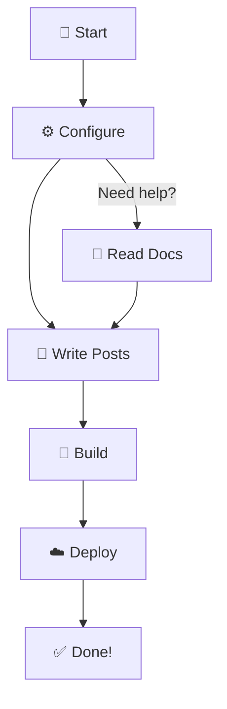
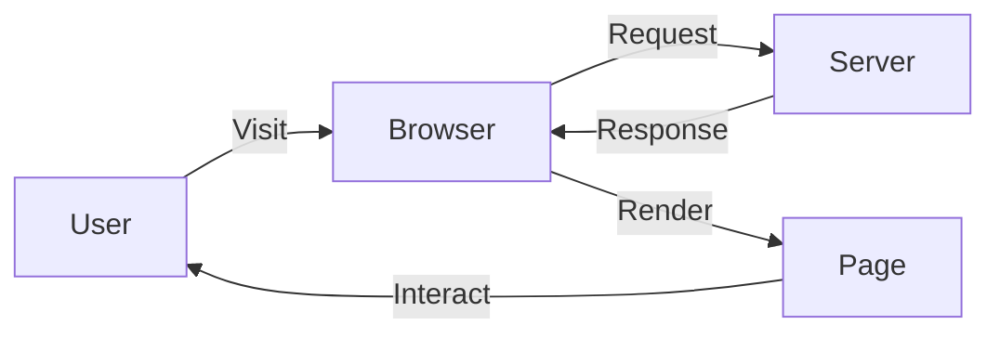
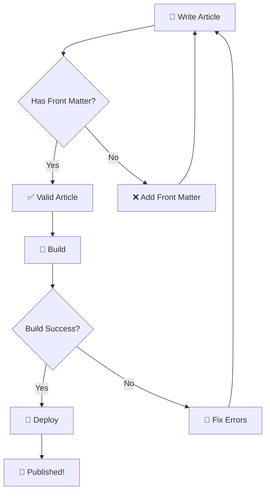
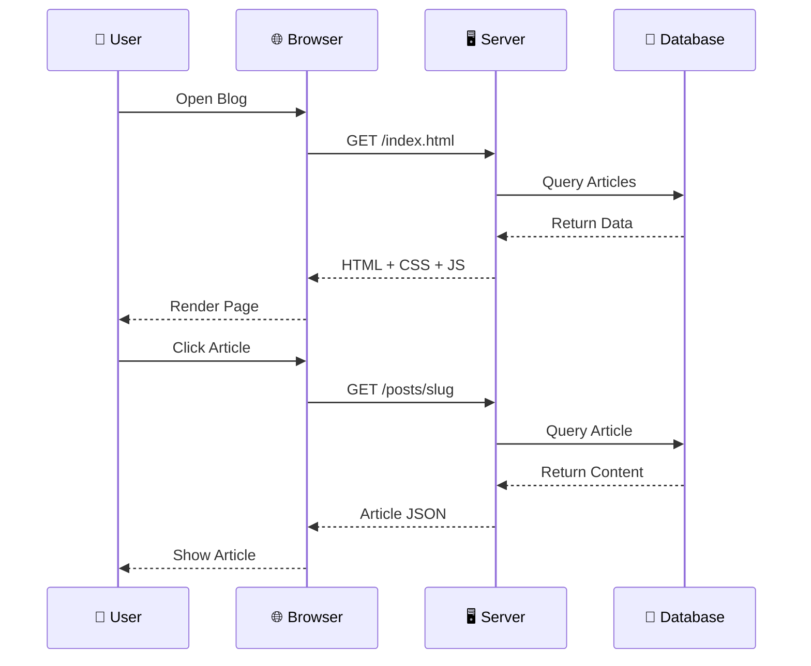
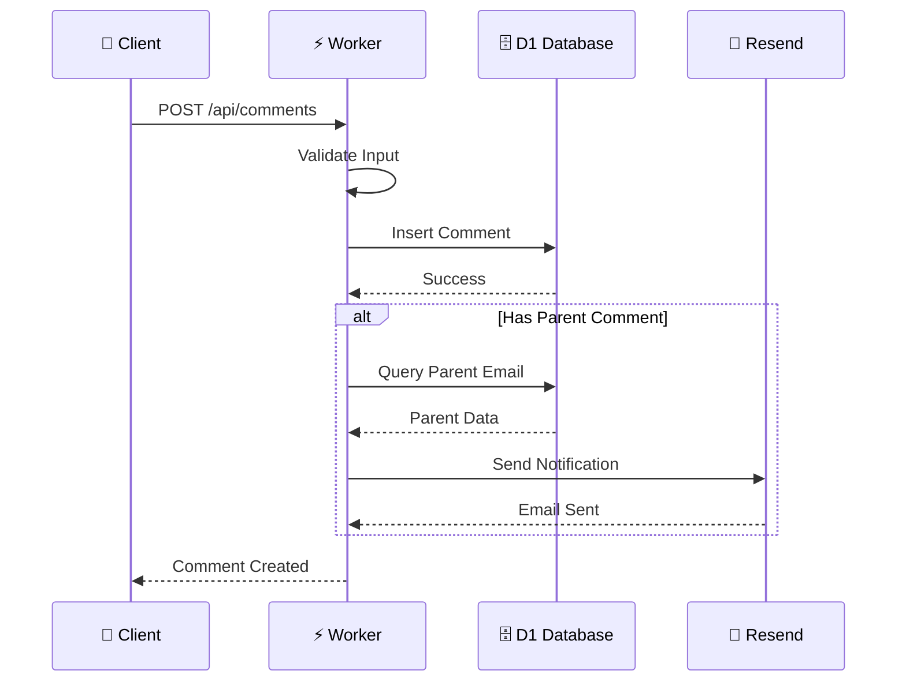
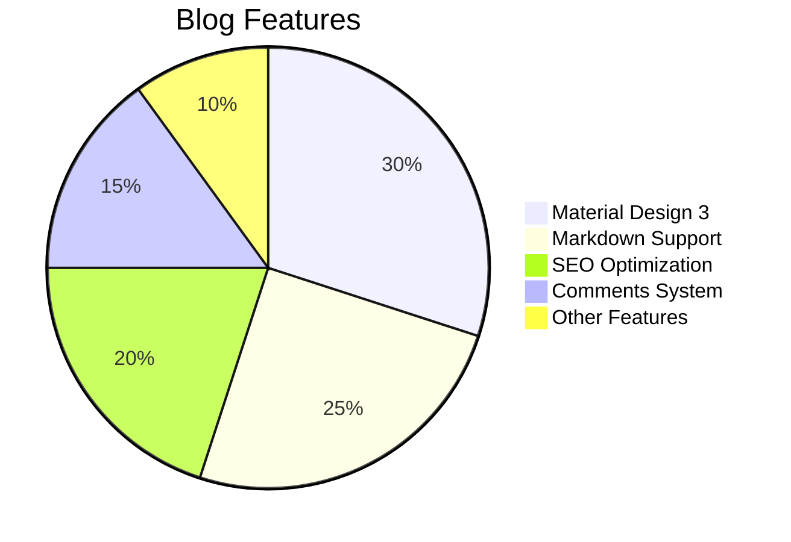
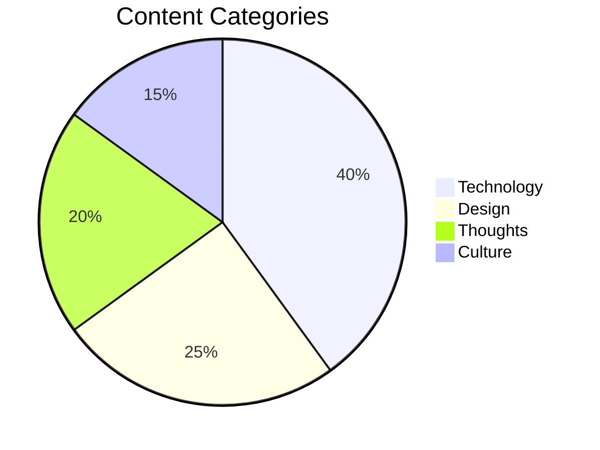

[TOC]

## Hello World

Welcome to your new blog! This is your first post. You can edit or delete it and start writing.

## Getting Started

### 1. Configure Your Blog

Edit `site.config.json`:

```json
{
  "title": "Your Blog Title",
  "tagline": "Your blog tagline",
  "author": "Your Name",
  "url": "https://your-domain.com"
}
```

### 2. Write Posts

Create a `.md` file in `content/blog/`:

```markdown
---
title: "Your Post Title"
date: "January 15, 2024"
dateISO: "2024-01-15"
readingTime: "5 min"
tags: ["Tag1", "Tag2"]
category: "tech"
excerpt: "A brief description."
---

Your content here...
```

### 3. Build and Deploy

```bash
# Build
node build.js

# Preview
cd dist && npx serve
```

## Features

- 🎨 Material Design 3 theme
- 🌙 Dark/Light mode
- 📱 Responsive design
- 🔍 Full-text search
- 📖 Auto-generated TOC
- 💬 Comments system (optional)
- 📊 Mermaid diagrams
- 📡 RSS feed

## Mermaid Diagrams

Haprial supports three types of Mermaid diagrams: Flowcharts, Sequence Diagrams, and Pie Charts.

### Flowchart (Top-Down)



### Flowchart (Left-Right)



### Flowchart with Decision



### Sequence Diagram



### Sequence Diagram (API Flow)



### Pie Chart



### Pie Chart (Content Distribution)



## Markdown Examples

### Code Blocks

```javascript
function fibonacci(n) {
  if (n <= 1) return n;
  return fibonacci(n - 1) + fibonacci(n - 2);
}

console.log(fibonacci(10)); // 55
```

### Tables

| Feature | Status | Description |
|---------|--------|-------------|
| Material Design 3 | ✅ | Light/Dark mode |
| Responsive | ✅ | All devices |
| SEO | ✅ | Meta tags, OG |
| Comments | ✅ | Optional |

### Footnotes

This is a sentence with a footnote[^1]. And another one[^2].

[^1]: This is the first footnote.
[^2]: This is the second footnote.

## Start Writing

Now, start your writing journey!

Happy blogging! 🎉
