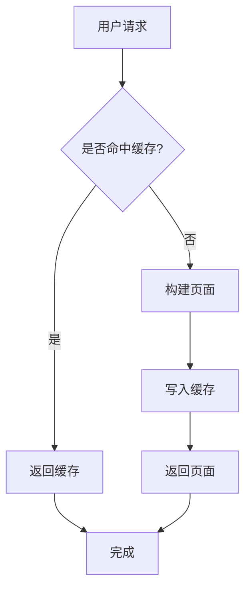
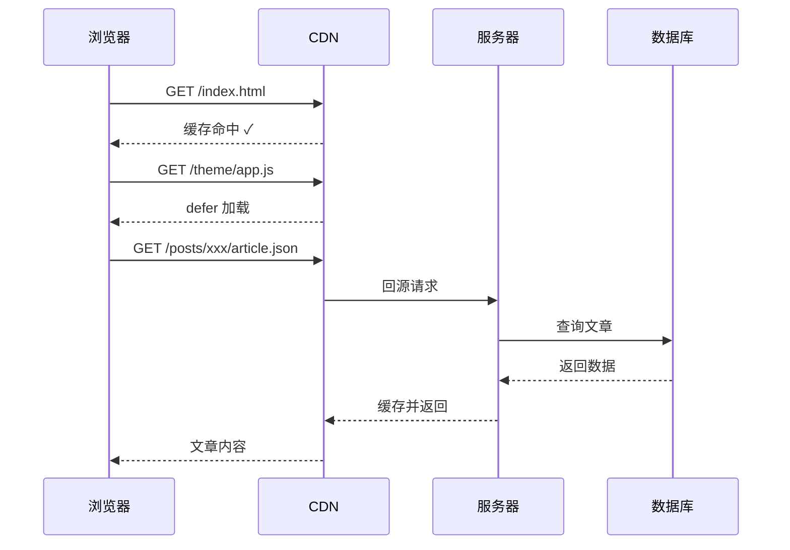
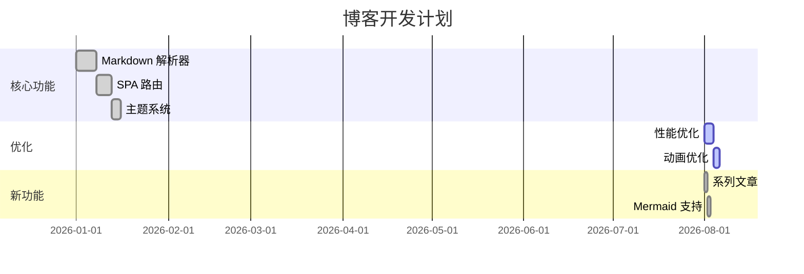
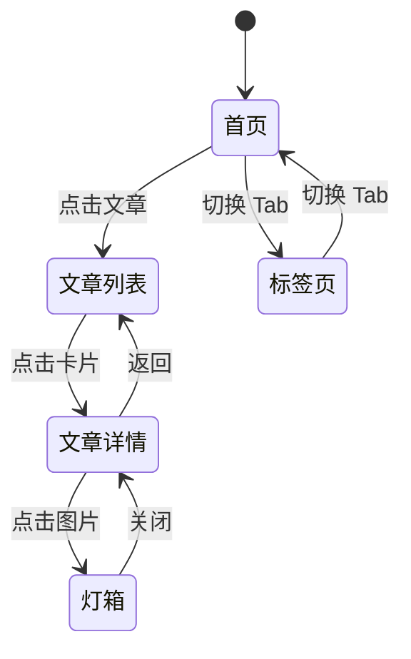
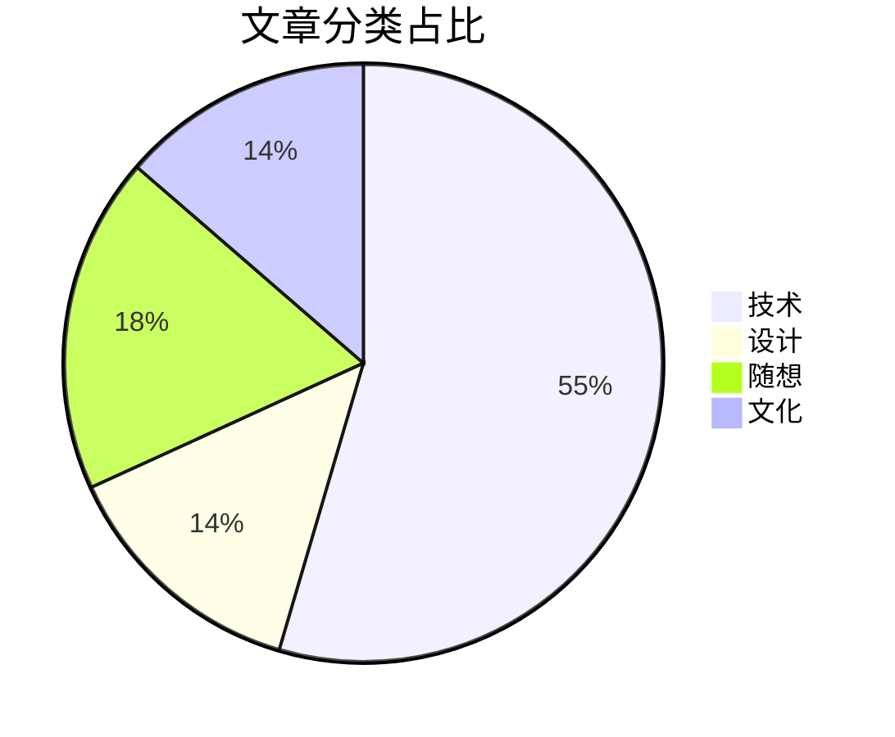

## 流程图 {#flowchart}


```mermaid
graph TD
    A[用户请求] --> B{是否命中缓存?}
    B -->|是| C[返回缓存]
    B -->|否| D[构建页面]
    D --> E[写入缓存]
    E --> F[返回页面]
    C --> G[完成]
    F --> G
```

## 时序图 {#sequence}


```mermaid
sequenceDiagram
    participant 浏览器
    participant CDN
    participant 服务器
    participant 数据库

    浏览器->>CDN: GET /index.html
    CDN-->>浏览器: 缓存命中 ✓
    浏览器->>CDN: GET /theme/app.js
    CDN-->>浏览器: defer 加载
    浏览器->>CDN: GET /posts/xxx/article.json
    CDN->>服务器: 回源请求
    服务器->>数据库: 查询文章
    数据库-->>服务器: 返回数据
    服务器-->>CDN: 缓存并返回
    CDN-->>浏览器: 文章内容
```

## 甘特图 {#gantt}


```mermaid
gantt
    title 博客开发计划
    dateFormat  YYYY-MM-DD
    section 核心功能
    Markdown 解析器   :done, a1, 2026-01-01, 7d
    SPA 路由          :done, a2, after a1, 5d
    主题系统          :done, a3, after a2, 3d
    section 优化
    性能优化          :active, b1, 2026-08-01, 3d
    动画优化          :active, b2, after b1, 2d
    section 新功能
    系列文章          :done, c1, 2026-08-01, 1d
    Mermaid 支持      :done, c2, after c1, 1d
```

## 状态图 {#state}


```mermaid
stateDiagram-v2
    [*] --> 首页
    首页 --> 文章列表 : 点击文章
    文章列表 --> 文章详情 : 点击卡片
    文章详情 --> 文章列表 : 返回
    文章详情 --> 灯箱 : 点击图片
    灯箱 --> 文章详情 : 关闭
    首页 --> 标签页 : 切换 Tab
    标签页 --> 首页 : 切换 Tab
```

## 使用方式 {#usage}

在 Markdown 中用 ` ```mermaid ` 代码块即可：


```mermaid
pie title 文章分类占比
    "技术" : 12
    "设计" : 3
    "随想" : 4
    "文化" : 3
```

博客引擎会自动加载 Mermaid.js 并渲染图表。深色模式下自动切换为深色主题。
