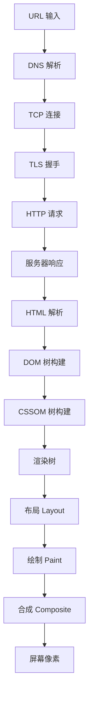
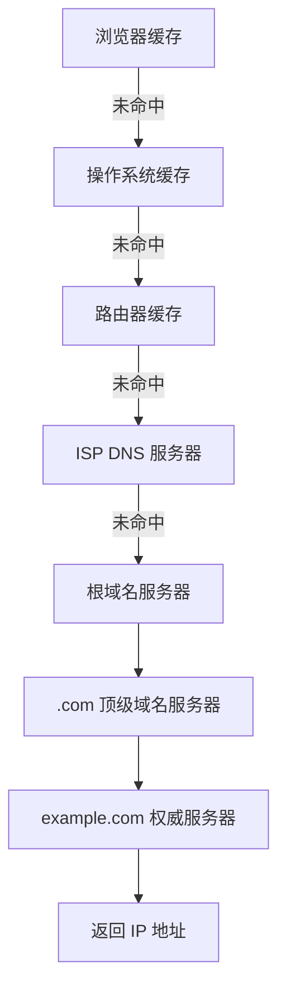
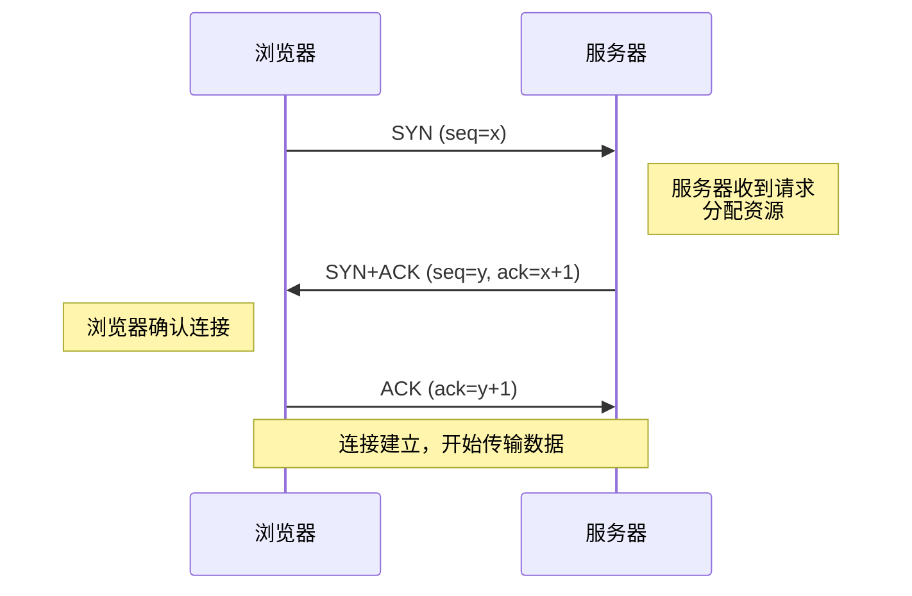
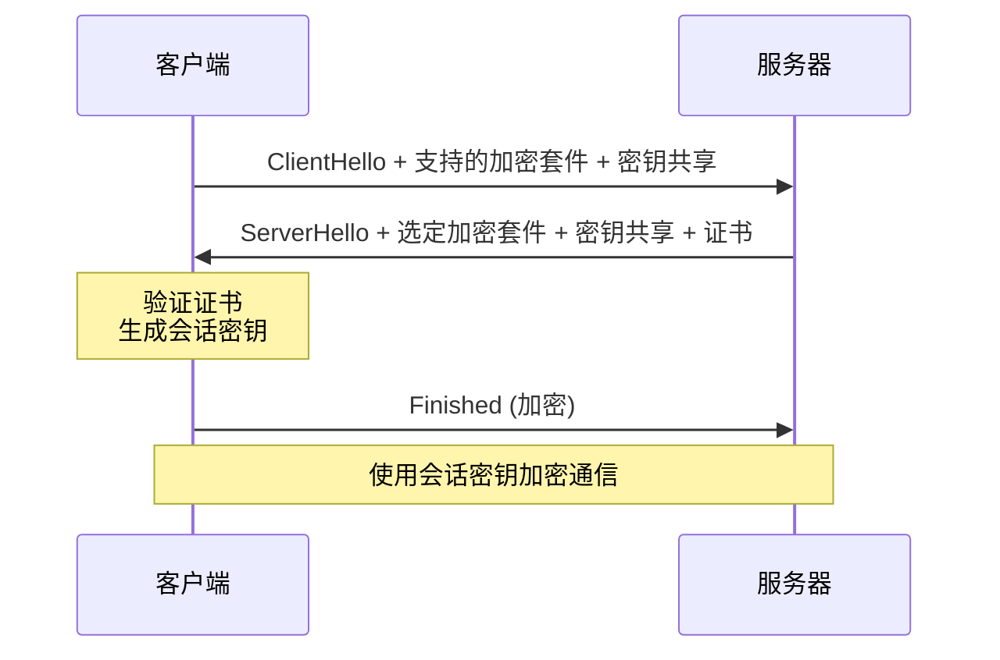
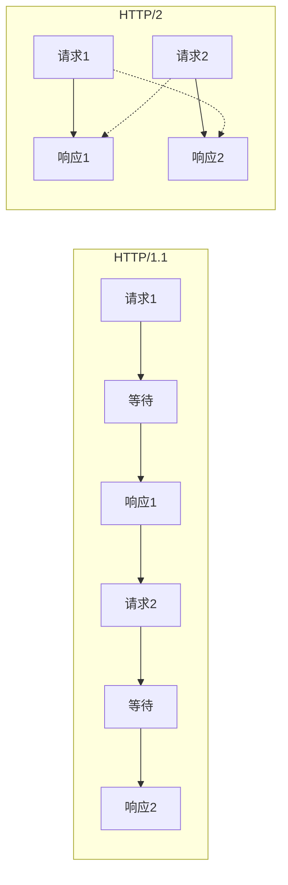
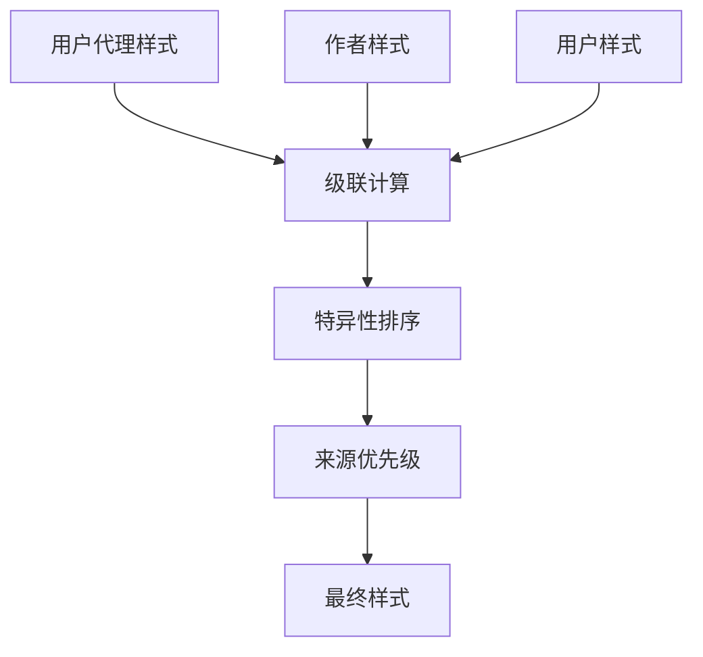
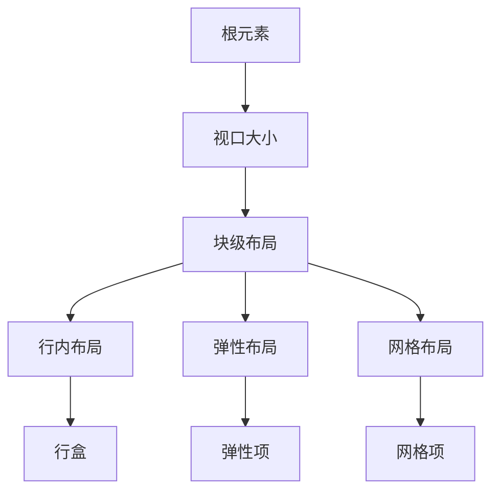
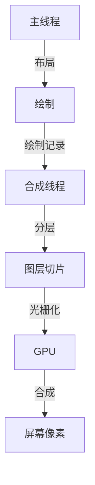
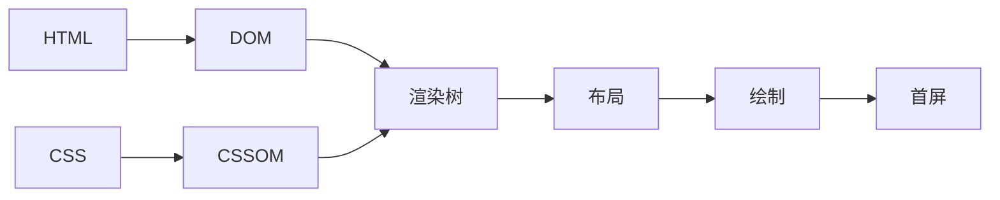
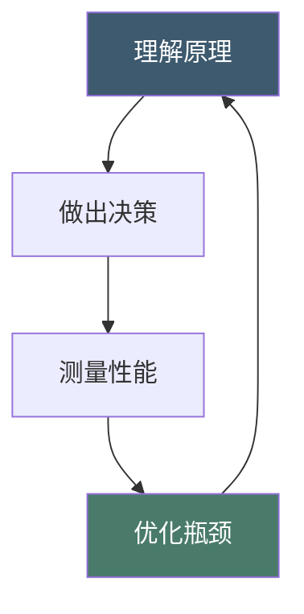

## 写在前面 {#intro}

每一个前端开发者都应该理解浏览器渲染原理。不是为了面试，而是因为**你不理解的东西，你无法优化它**。

这篇文章会从一个 URL 请求开始，追踪数据流经的每一层：网络 → 解析 → 布局 → 绘制 → 合成 → 屏幕像素。每一步都有它的原理、瓶颈和优化手段。



## 第一章：网络层 {#network}

### 1.1 DNS 解析 {#dns}

当你在浏览器输入 `https://example.com`，第一件事不是建立连接，而是**找到这个域名对应的 IP 地址**。

DNS 解析的过程像一个层层递进的查询系统：



每一层缓存都有 TTL（Time To Live）。DNS 解析通常需要 20-120ms，这是不可避免的网络延迟。

**优化手段**：
- `dns-prefetch`：提前解析域名
- DNS 预取：`<link rel="dns-prefetch" href="//cdn.example.com">`
- 使用 HTTP/2 的连接复用，减少 DNS 查询次数

### 1.2 TCP 三次握手 {#tcp}

拿到 IP 地址后，浏览器需要和服务器建立 TCP 连接。这个过程需要**三个数据包**：



三次握手的设计哲学是**双向确认**。两次握手不够——服务器不知道客户端是否收到了它的确认。四次握手浪费——三次已经足够证明双方都能收发数据。

**TCP 的可靠传输机制**：

| 机制 | 作用 | 原理 |
|------|------|------|
| 序列号 | 数据排序 | 每个字节都有唯一编号 |
| 确认应答 | 丢包检测 | 接收方回复 ACK 确认收到 |
| 超时重传 | 丢包恢复 | 超时未收到 ACK 则重发 |
| 滑动窗口 | 流量控制 | 根据接收方缓冲区大小调整发送速率 |
| 拥塞控制 | 网络保护 | 慢启动 → 拥塞避免 → 快重传 → 快恢复 |

### 1.3 TLS 握手 {#tls}

HTTPS 在 TCP 之上还需要 TLS 握手来建立加密通道。TLS 1.3 的握手只需要 **1-RTT**：



TLS 1.2 需要 2-RTT，TLS 1.3 优化到 1-RTT，且支持 0-RTT 恢复（会话复用时完全消除握手延迟）。

### 1.4 HTTP 请求与响应 {#http}

连接建立后，浏览器发送 HTTP 请求。HTTP/2 带来了几个关键优化：

**多路复用**：在一个 TCP 连接上并行传输多个请求/响应，解决了 HTTP/1.1 的队头阻塞问题。

**头部压缩**：HPACK 算法压缩请求头，减少传输数据量。

**服务器推送**：服务器可以主动推送客户端可能需要的资源。



## 第二章：解析层 {#parsing}

### 2.1 HTML 解析与 DOM 树 {#dom}

浏览器收到 HTML 字节流后，需要将其转换为一棵 DOM（Document Object Model）树。这个过程分为几个阶段：


**Token 化**是将字符流分割成语义单元（标签、属性、文本）。HTML 解析器使用**状态机**来处理这个过程——它逐字符读取，根据当前状态和输入字符决定下一步动作。

HTML 解析的一个关键特性是**容错性**。浏览器不会因为语法错误就停止解析，而是尝试猜测开发者的意思。例如：

```html
<!-- 缺少闭合标签 -->
<p>段落一
<p>段落二

<!-- 浏览器解析为 -->
<p>段落一</p>
<p>段落二</p>
```

这种容错机制让 HTML 更健壮，但也意味着解析器需要维护复杂的状态机。Chrome 的 HTML 解析器有 **超过 1000 个状态**。

### 2.2 CSS 解析与 CSSOM 树 {#cssom}

CSS 的解析和 HTML 并行进行。CSSOM（CSS Object Model）树表示所有 CSS 规则的结构化表示。

CSS 解析的复杂性在于**级联（Cascade）**。当多个规则匹配同一个元素时，浏览器需要计算最终样式：



特异性的计算规则：

| 选择器 | 特异性 | 示例 |
|--------|--------|------|
| 内联样式 | 1000 | `style="color:red"` |
| ID 选择器 | 100 | `#header` |
| 类选择器 | 10 | `.nav` |
| 元素选择器 | 1 | `div` |
| 通配符 | 0 | `*` |

### 2.3 渲染树的构建 {#render-tree}

DOM 树和 CSSOM 树合并成**渲染树（Render Tree）**。渲染树只包含需要渲染的节点——`display: none` 的元素不会出现在渲染树中。

```mermaid
graph TD
    subgraph DOM树
        A[html] --> B[body]
        B --> C[div.visible]
        B --> D[div.hidden]
    end
    subgraph CSSOM树
        E[.visible {display:block}]
        F[.hidden {display:none}]
    end
    subgraph 渲染树
        G[RenderObject: div.visible]
    end
    DOM树 --> 渲染树
    CSSOM树 --> 渲染树
```

### 2.4 脚本阻塞与解析策略 {#blocking}

JavaScript 可以修改 DOM 和 CSSOM，所以解析 HTML 遇到 `<script>` 标签时会**暂停解析**，等待脚本下载和执行完成。

这就是为什么 `<script>` 标签的位置很重要：

```html
<!-- 阻塞渲染 -->
<script src="app.js"></script>

<!-- 异步加载，下载不阻塞，执行阻塞 -->
<script async src="analytics.js"></script>

<!-- 延迟加载，下载不阻塞，DOM 解析完后执行 -->
<script defer src="app.js"></script>
```

我们的博客使用了 `defer` 策略——app.js 在 DOM 解析完成后才执行，不阻塞首屏渲染。

## 第三章：布局与绘制 {#layout-paint}

### 3.1 布局（Layout）{#layout}

布局是计算每个元素**精确位置和大小**的过程。也叫回流（Reflow）。

布局的计算基于：
- 盒模型（margin, border, padding, content）
- 包含块（containing block）
- 格式化上下文（BFC, IFC, FFC, GFC）
- 浮动和定位



**布局是性能的关键瓶颈之一**。每次修改几何属性（width, height, position）都会触发重新布局。

### 3.2 绘制（Paint）{#paint}

绘制是将布局计算结果转换为**像素**的过程。也叫重绘（Repaint）。

绘制分为多个层：
1. 背景层（background）
2. 浮动层（float）
3. 内容层（content）
4. 定位层（position）
5. 轮廓层（outline）

每个层独立绘制，然后合并。这就是为什么 `z-index` 可以控制层叠顺序。

### 3.3 布局抖动（Layout Thrashing）{#thrashing}

当 JavaScript 交替读取和写入布局属性时，会强制浏览器同步计算布局——这就是**布局抖动**。

```javascript
// 布局抖动！每读一次 offsetHeight 都触发一次布局计算
for (var i = 0; i < elements.length; i++) {
  var height = elements[i].offsetHeight;  // 读（触发布局）
  elements[i].style.height = height + 10 + 'px';  // 写（标记脏）
}
```

**优化策略**：先批量读取，再批量写入。

```javascript
// 优化：先读完所有高度
var heights = [];
for (var i = 0; i < elements.length; i++) {
  heights.push(elements[i].offsetHeight);
}
// 再写入
for (var i = 0; i < elements.length; i++) {
  elements[i].style.height = heights[i] + 10 + 'px';
}
```

我们的博客在滚动处理中严格遵循了这个原则——先读 `scrollTop`，再写 `classList`。

## 第四章：合成层 {#composite}

### 4.1 合成（Composite）{#composite-intro}

合成是渲染流水线的最后一步。浏览器将不同的绘制层**合成**为最终图像，显示在屏幕上。

现代浏览器使用 **GPU 加速合成**。某些属性（`transform`, `opacity`）的动画可以完全在 GPU 上执行，不触发布局和绘制——这就是为什么它们的性能最好。



### 4.2 层的创建与管理 {#layers}

浏览器会自动将某些元素提升为独立的合成层：

| 触发条件 | 原因 |
|----------|------|
| `transform: translateZ(0)` | 强制提升 |
| `will-change: transform` | 提示浏览器 |
| `position: fixed` | 独立定位 |
| `<video>`, `<canvas>` | 原生内容 |
| CSS 动画中的元素 | 动画优化 |

层太多也有代价——每个层都需要 GPU 内存。我们的博客使用 `will-change` 仅在需要时提示浏览器，避免不必要的层创建。

### 4.3 重排、重绘与合成的性能对比 {#perf}

| 操作 | 触发 | 性能 | 示例 |
|------|------|------|------|
| 改变 width/height | 重排 + 重绘 + 合成 | ❌ 最慢 | `width: 100px → 200px` |
| 改变 color/background | 重绘 + 合成 | ⚠️ 中等 | `color: red → blue` |
| 改变 transform | 仅合成 | ✅ 最快 | `translateX(0 → 100px)` |
| 改变 opacity | 仅合成 | ✅ 最快 | `opacity: 0 → 1` |

**这就是为什么我们的博客所有动画都只用 `transform` 和 `opacity`**。从文章卡片的入场动画，到页面切换的滑入效果，到进度条的跟随滚动——全部是合成层操作。

## 第五章：性能优化实战 {#optimization}

### 5.1 关键渲染路径 {#critical-path}

从 URL 到首屏像素，必须经过的最小资源集合叫**关键渲染路径（Critical Rendering Path）**。



优化关键渲染路径的策略：
1. **减少关键资源数量**：内联关键 CSS，延迟非关键 CSS
2. **减少关键资源大小**：压缩、minify
3. **减少关键路径长度**：减少往返次数

我们的博客通过**内联 CSS + 延迟 app.js**，将关键路径从 3 个资源（HTML + CSS + JS）减少到 1 个（HTML，CSS 内联其中）。

### 5.2 防抖与节流 {#debounce-throttle}

滚动和 resize 事件每秒触发几十次，直接处理会严重影响性能。

**防抖（Debounce）**：等待一段时间没有新事件后才执行。适用于搜索输入。

**节流（Throttle）**：每 N 毫秒最多执行一次。适用于滚动处理。

```javascript
// 节流：每 100ms 最多执行一次
function throttle(fn, ms) {
  var timer = null;
  return function() {
    if (timer) return;
    timer = setTimeout(function() {
      timer = null;
      fn();
    }, ms);
  };
}
```

我们的博客使用了**双重节流**：100ms throttle + requestAnimationFrame，确保滚动处理不超过 60fps。

### 5.3 虚拟滚动与分页 {#virtual-scroll}

当列表项很多时，DOM 节点越多，布局和绘制越慢。

我们的博客使用**分页**（每页 6 篇文章）而非虚拟滚动——因为文章卡片有复杂的动画和交互，虚拟滚动的实现成本太高，分页是更务实的选择。

## 第六章：开发者工具 {#devtools}

### 6.1 Performance 面板 {#performance}

Chrome DevTools 的 Performance 面板可以录制页面的完整渲染过程：

- **Frames**：每帧的渲染时间，超过 16ms 就会掉帧
- **Main**：主线程活动，可以查看布局、绘制、JS 执行时间
- **Compositor**：合成线程活动

### 6.2 Lighthouse {#lighthouse}

Lighthouse 提供自动化的性能评估：

| 指标 | 含义 | 目标 |
|------|------|------|
| FCP | 首次内容绘制 | < 1.8s |
| LCP | 最大内容绘制 | < 2.5s |
| CLS | 累积布局偏移 | < 0.1 |
| TBT | 总阻塞时间 | < 200ms |
| TTI | 可交互时间 | < 3.8s |

## 总结 {#summary}

浏览器渲染是一个复杂但有章可循的过程。理解它，你就能做出正确的技术决策：

- **为什么用 transform 动画？** 因为它只触发合成层，不重排不重绘
- **为什么内联 CSS？** 因为减少关键渲染路径的资源数量
- **为什么用 defer 加载 JS？** 因为不阻塞 HTML 解析
- **为什么用 will-change？** 因为提示浏览器创建合成层
- **为什么先读后写？** 因为避免布局抖动

每一个优化决策的背后，都是对渲染流水线的深刻理解。



性能优化不是一次性的工作，而是一个**持续的循环**：理解 → 决策 → 测量 → 优化 → 再理解。

---

*这篇文章描述的渲染流水线适用于 Chromium 内核的浏览器（Chrome, Edge, Opera）。Firefox 和 Safari 的实现细节有所不同，但核心原理一致。*
