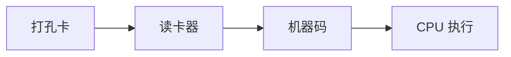
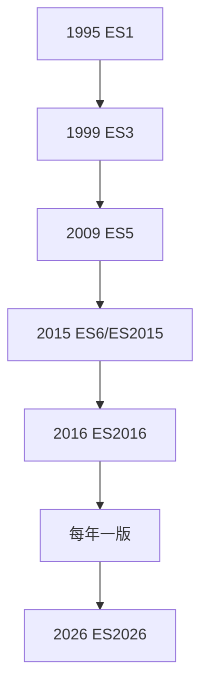
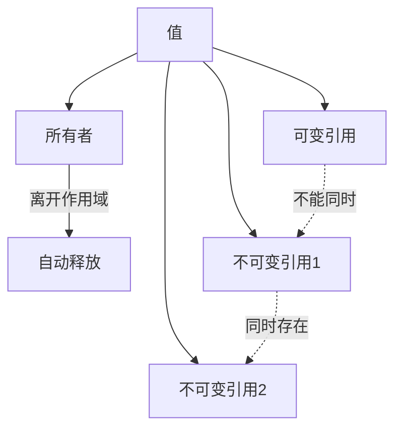
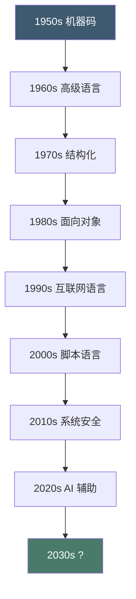
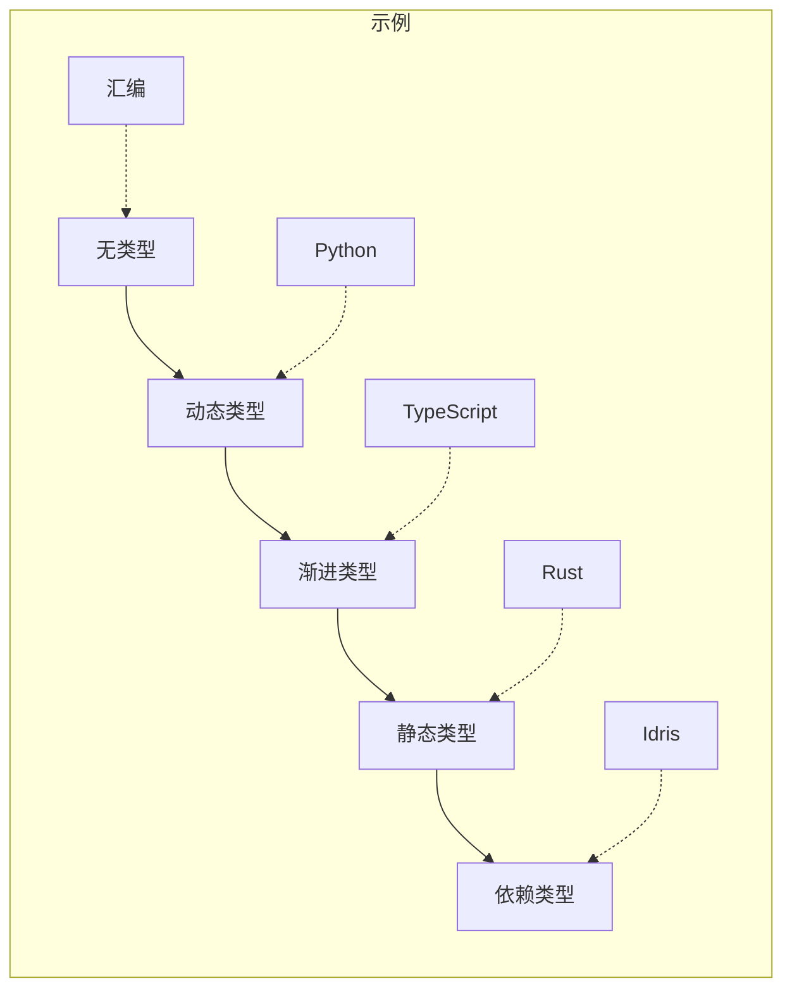
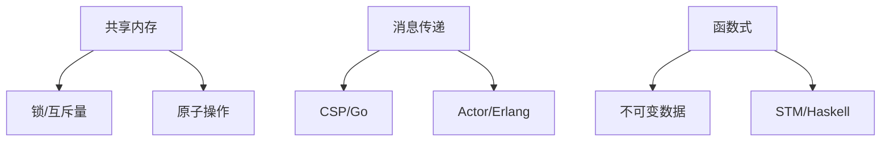
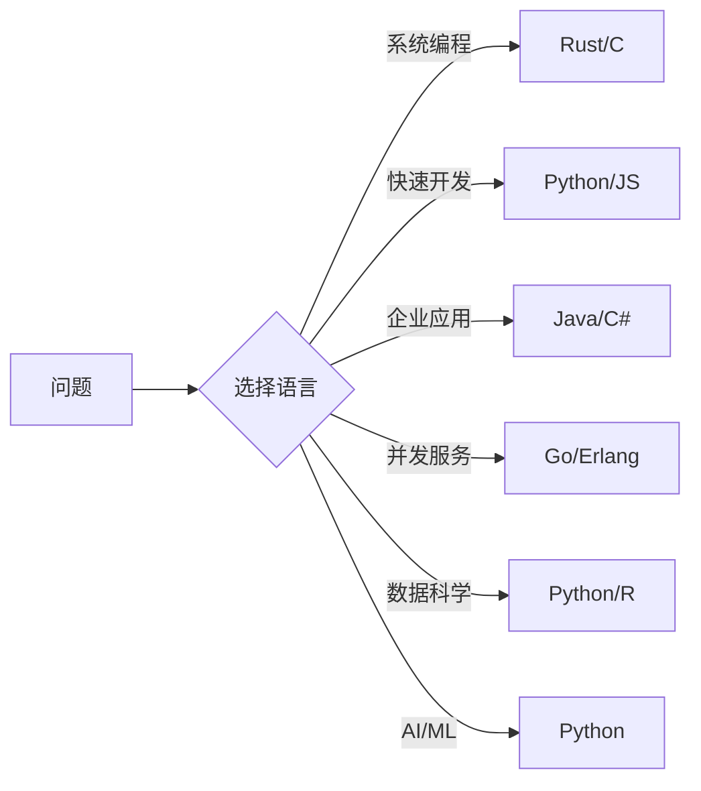

## 机器的低语：第一代语言 {#machine}

### 打孔卡与机器码 {#punch-card}

1940 年代，编程意味着在打孔卡上打孔。每一张卡片代表一条指令，程序员需要手动计算内存地址。



机器码是纯粹的二进制——`10110000 00000001` 表示 "将 1 加载到寄存器 AL"。人类可以直接理解它，但效率极低，错误率极高。

### 汇编语言 {#assembly}

1950 年代，汇编语言出现了。它用助记符替代二进制码：

```nasm
; 机器码: 10110000 00000001
; 汇编语言:
MOV AL, 1       ; 将 1 加载到寄存器 AL
ADD AL, 2       ; AL = AL + 2
MOV [result], AL ; 将结果存到内存
```

汇编语言是**一一对应**的——每条汇编指令对应一条机器指令。这使得它非常高效，但也非常底层。

## 抽象的黎明：高级语言 {#high-level}

### Fortran：数学家的语言 {#fortran}

1957 年，John Backus 团队在 IBM 开发了 Fortran（Formula Translation）。这是第一个广泛使用的高级语言。

```fortran
! Fortran 计算圆的面积
PROGRAM CIRCLE
  REAL :: R, AREA
  R = 5.0
  AREA = 3.14159 * R * R
  PRINT *, 'Area = ', AREA
END PROGRAM CIRCLE
```

Fortran 的革命性在于：程序员可以用**接近数学公式**的方式写代码，编译器负责翻译成机器码。

### LISP：AI 的母语 {#lisp}

1958 年，John McCarthy 创建了 LISP（List Processing）。LISP 的核心思想是**代码即数据**——程序和数据用同一种结构（列表）表示。

```lisp
; LISP 的递归：阶乘
(defun factorial (n)
  (if (<= n 1)
      1
      (* n (factorial (- n 1)))))

(factorial 5)  ; => 120
```

LISP 对编程语言的影响深远：
- **垃圾回收**：自动内存管理
- **动态类型**：变量不需要声明类型
- **递归**：作为控制流的基本手段
- **REPL**：交互式编程环境

### COBOL：商业的语言 {#cobol}

1959 年，Grace Hopper 主导开发了 COBOL（Common Business Oriented Language）。COBOL 的设计目标是让非程序员也能读懂代码：

```cobol
IDENTIFICATION DIVISION.
PROGRAM-ID. HELLO-WORLD.
PROCEDURE DIVISION.
    DISPLAY "Hello, World!".
    STOP RUN.
```

COBOL 被广泛批评为冗长，但它至今仍在运行全球 70% 的商业交易。

## 结构化革命：1970s {#structured}

### C 语言：操作系统的心脏 {#c}

1972 年，Dennis Ritchie 在贝尔实验室开发了 C 语言。C 的设计哲学是**信任程序员**——它提供指针、直接内存访问，不做运行时检查。

```c
#include <stdio.h>

int main() {
    int arr[] = {1, 2, 3, 4, 5};
    int *p = arr;  // 指针
    
    for (int i = 0; i < 5; i++) {
        printf("%d ", *(p + i));
    }
    return 0;
}
```

C 语言的影响：
- **Unix 操作系统**：用 C 重写，开创了操作系统的新纪元
- **指针模型**：直接内存操作，高效但危险
- **编译器生态**：GCC、Clang、MSVC
- **派生语言**：C++、Java、C#、JavaScript、Go、Rust 都受 C 影响

### Pascal 与结构化编程 {#pascal}

1970 年，Niklaus Wirth 创建了 Pascal。Pascal 强调**结构化编程**——使用顺序、选择、循环三种基本结构，禁用 GOTO。

```pascal
program Hello;
begin
  WriteLn('Hello, World!');
end.
```

Edsger Dijkstra 在 1968 年发表了著名的论文《Go To Statement Considered Harmful》，推动了结构化编程运动。

## 面向对象：1980s {#oop}

### C++：C 的超集 {#cpp}

1979 年，Bjarne Stroustrup 在贝尔实验室开始开发 C++。C++ 在 C 的基础上增加了**面向对象**特性：

```cpp
#include <iostream>
using namespace std;

class Shape {
public:
    virtual double area() = 0;  // 纯虚函数
};

class Circle : public Shape {
    double radius;
public:
    Circle(double r) : radius(r) {}
    double area() override { return 3.14159 * radius * radius; }
};

int main() {
    Circle c(5);
    cout << "Area: " << c.area() << endl;
    return 0;
}
```

C++ 的设计哲学是**零成本抽象**——你不使用的特性不会带来运行时开销。这个理念影响了后来的 Rust。

### Smalltalk 与消息传递 {#smalltalk}

Smalltalk 是纯粹的面向对象语言——**一切皆对象**，包括数字和布尔值。

```smalltalk
"Smalltalk 的消息传递"
3 + 4  
"实际上是向对象 3 发送消息 +，参数是 4"
```

Smalltalk 的影响：
- **消息传递**：对象之间通过消息通信
- **GUI**：第一个图形用户界面环境
- **IDE**：集成开发环境的概念
- **设计模式**：GoF 的设计模式基于 Smalltalk

### Objective-C {#objc}

Brad Cox 在 1984 年创建了 Objective-C，将 Smalltalk 的消息传递风格嫁接到 C 上。后来成为 Apple 平台的主要语言，直到 Swift 出现。

## 互联网时代：1990s {#internet-era}

### Java：一次编写，到处运行 {#java}

1995 年，James Gosling 在 Sun Microsystems 开发了 Java。Java 的核心卖点是**跨平台**——通过 JVM（Java Virtual Machine），同一份代码可以在任何平台上运行。

```java
public class Hello {
    public static void main(String[] args) {
        System.out.println("Hello, World!");
    }
}
```

Java 的设计决策：
- **自动垃圾回收**：程序员不需要手动释放内存
- **强类型**：类型检查严格，减少运行时错误
- **字节码**：编译为中间代码，由 JVM 执行
- **异常处理**：try-catch 机制

### JavaScript：浏览器的唯一语言 {#javascript}

1995 年，Brendan Eich 在 Netscape 用 **10 天** 创建了 JavaScript。这个仓促的创造成为了互联网的基石。

```javascript
// JavaScript 的灵活性（和混乱）
typeof null      // "object"（历史包袱）
[] + []           // ""（空字符串）
[] + {}           // "[object Object]"
{} + []           // 0（?!）
```

JavaScript 的演化：



### Python：简洁的哲学 {#python}

1991 年，Guido van Rossum 创建了 Python。Python 的设计哲学是**可读性第一**：

```python
# Python 之禅
import this
# "Beautiful is better than ugly."
# "Explicit is better than implicit."
# "Simple is better than complex."
```

Python 的成功在于它的**通用性**——从 Web 开发（Django）到数据科学（Pandas）到 AI（PyTorch），Python 无处不在。

## 系统编程的新范式：2010s {#system}

### Go：简洁的系统语言 {#go}

2009 年，Google 的 Robert Griesemer、Rob Pike、Ken Thompson 创建了 Go。Go 的设计目标是**简单、高效、并发**：

```go
package main

import (
    "fmt"
    "sync"
)

func main() {
    var wg sync.WaitGroup
    
    for i := 0; i < 5; i++ {
        wg.Add(1)
        go func(n int) {
            defer wg.Done()
            fmt.Printf("Goroutine %d\n", n)
        }(i)
    }
    
    wg.Wait()
}
```

Go 的核心创新是 **goroutine**——轻量级协程，可以轻松创建数十万个并发任务。

### Rust：安全的系统语言 {#rust}

2010 年，Mozilla 的 Graydon Hoare 开始开发 Rust。Rust 的核心创新是**所有权系统**——在编译时保证内存安全，不需要垃圾回收。

```rust
fn main() {
    let s1 = String::from("hello");
    let s2 = s1;  // s1 的所有权转移给 s2
    // println!("{}", s1);  // 编译错误！s1 已经失效
    println!("{}", s2);     // OK
}
```

Rust 的所有权规则：
1. 每个值有且只有一个所有者
2. 所有者离开作用域时，值被自动释放
3. 可以有多个不可变引用，或一个可变引用，但不能同时存在



### TypeScript：JavaScript 的类型安全 {#typescript}

2012 年，微软的 Anders Hejlsberg（也是 C# 的设计者）创建了 TypeScript。TypeScript 在 JavaScript 的基础上增加了**静态类型**：

```typescript
interface Article {
  title: string;
  date: string;
  tags: string[];
  pinned?: boolean;
}

function renderArticle(article: Article): string {
  return `<h1>${article.title}</h1>`;
}
```

TypeScript 的成功在于它的**渐进性**——可以从 JavaScript 逐步迁移，不需要重写所有代码。

## AI 时代：2020s {#ai-era}

### GitHub Copilot 与 AI 编程 {#copilot}

2021 年，GitHub 发布了 Copilot——一个基于大语言模型的代码助手。它可以根据注释和上下文自动生成代码。

```python
# 用 Copilot 生成代码
# 写一个函数，计算两个日期之间的工作日数量

def count_working_days(start_date, end_date):
    """计算两个日期之间的工作日数量（排除周末）"""
    working_days = 0
    current = start_date
    while current <= end_date:
        if current.weekday() < 5:  # 0-4 是周一到周五
            working_days += 1
        current += timedelta(days=1)
    return working_days
```

AI 编程的影响：
- **生产力提升**：重复性代码自动生成
- **学习加速**：不熟悉的语言/框架也能快速上手
- **代码质量**：AI 通常生成符合规范的代码
- **程序员角色变化**：从"写代码"转向"审查和架构"

### 编程语言的未来 {#future}



## 语言设计的永恒话题 {#eternal}

### 类型系统 {#type-system}



### 内存管理 {#memory}

| 策略 | 语言 | 优点 | 缺点 |
|------|------|------|------|
| 手动管理 | C, C++ | 最高性能 | 内存泄漏、悬垂指针 |
| 垃圾回收 | Java, Go, Python | 安全 | 停顿、内存开销 |
| 所有权系统 | Rust | 安全 + 高性能 | 学习曲线陡峭 |
| 引用计数 | Swift, Python | 确定性释放 | 循环引用 |

### 并发模型 {#concurrency}



## 结语 {#conclusion}

编程语言的演化不是线性的进步，而是**多元的探索**。每种语言都是一种思维方式的实验：

- **C** 说：信任程序员，给他们最大的自由
- **Rust** 说：在编译时证明安全，不给犯错的机会
- **Python** 说：可读性比性能更重要
- **Haskell** 说：纯函数和不可变性是正确的道路
- **JavaScript** 说：灵活性和生态比优雅更重要

没有最好的语言，只有最合适的语言。理解每种语言的设计哲学，才能在面对问题时做出正确的选择。



编程语言的故事，就是人类用计算解决问题的故事。这个故事还在继续——下一个改变世界的语言，也许此刻正在某个程序员的脑海中孕育。
