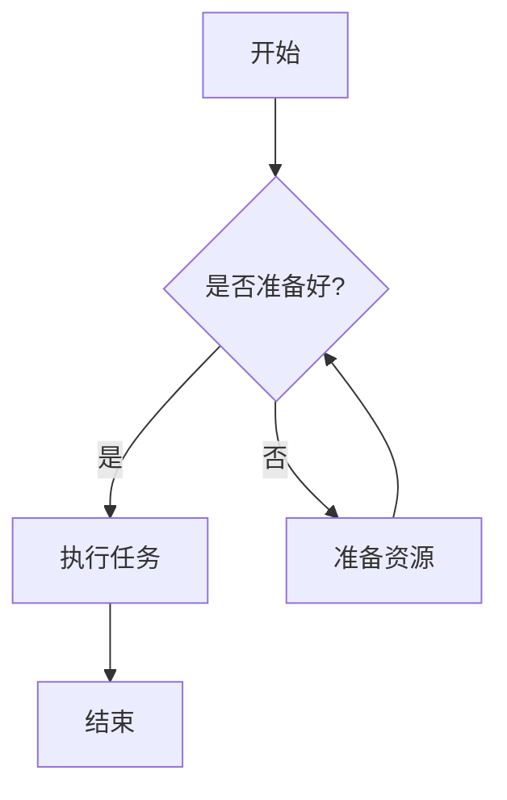
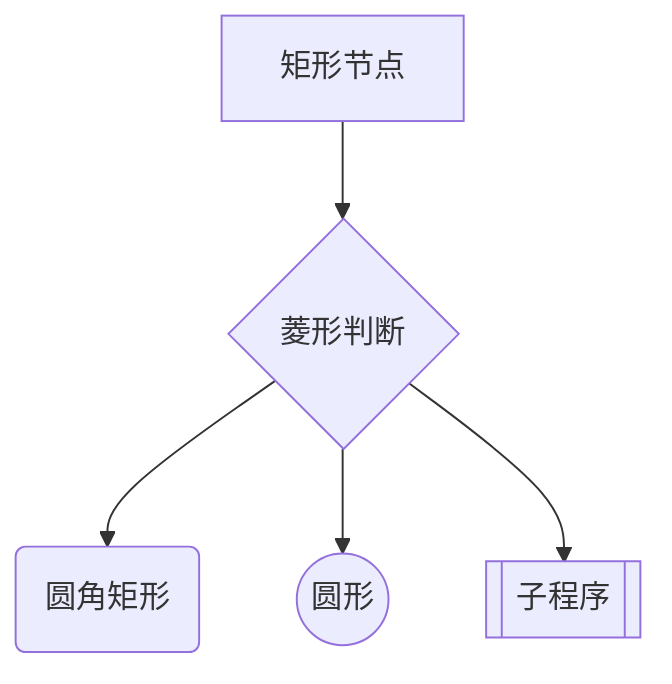
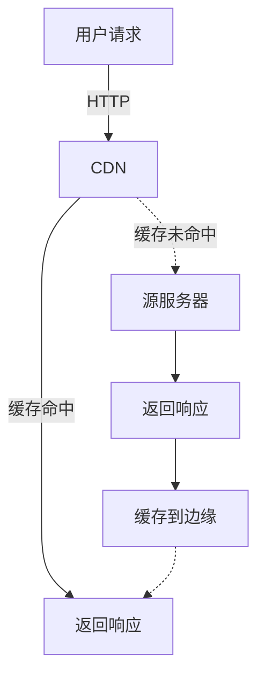
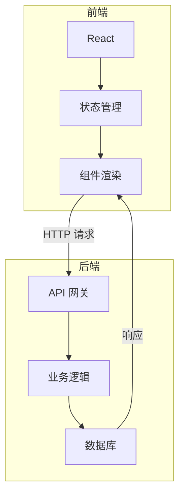
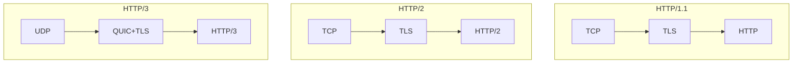
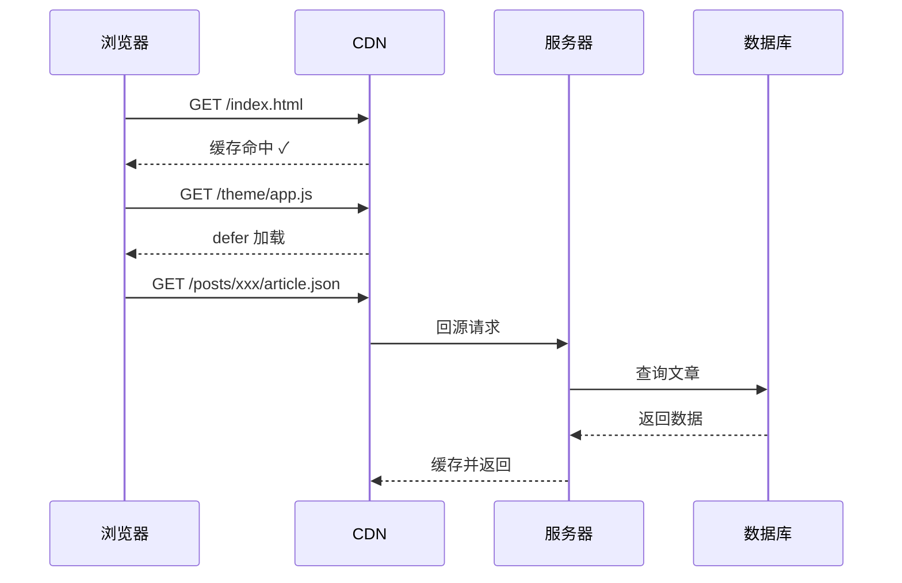
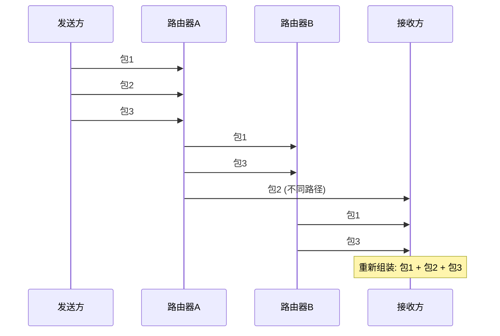
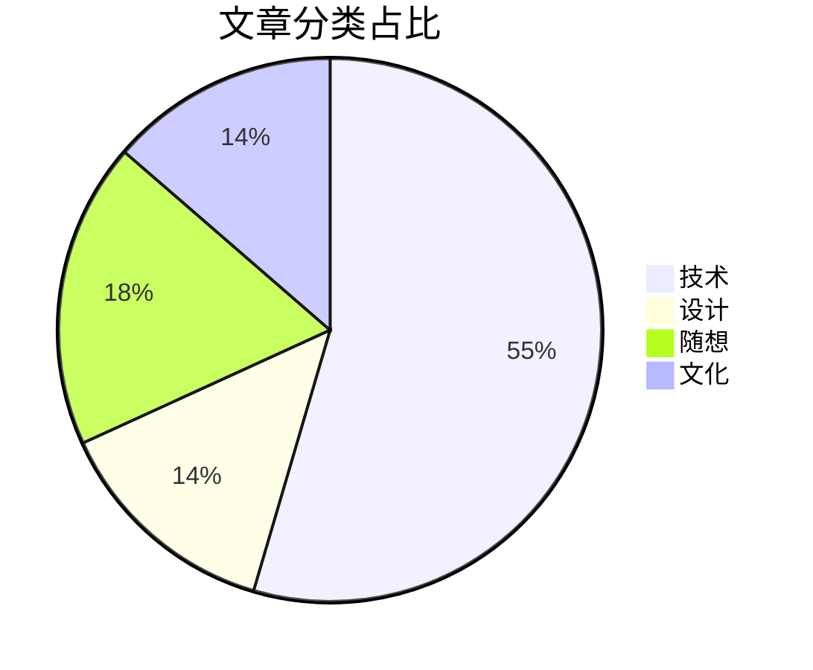
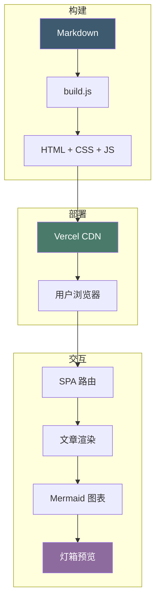

Mermaid 是一种用文本语法绘制图表的工具。不需要拖拽、不需要鼠标，纯文本就能生成专业级的图表。这篇文章展示本站支持的所有 Mermaid 语法。

## 基础流程图

最简单的流程图，从上到下：

从左到右：

## 多种节点形状

## 边标签与虚线

## 子图分组

用 `subgraph ... end` 将相关节点分组：

另一个例子——网络协议分层：

## 自定义节点样式

用 `style` 指令给节点上色：

## 序列图

展示多个参与者之间的交互：

带注解的序列图：

## 饼图

## 综合示例：博客架构

## 交互功能

所有图表都支持：

- **放大缩小**：点击右上角 +/- 按钮
- **拖拽平移**：放大后拖动图表
- **双指缩放**：移动端支持捏合手势

---

*这些图表全部用文本语法生成，不需要任何绘图工具。*
